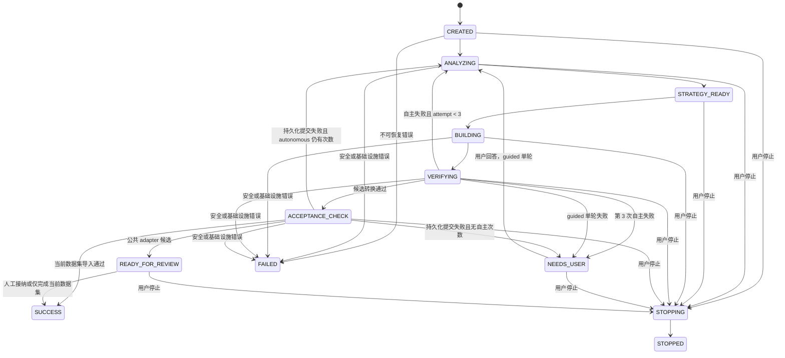
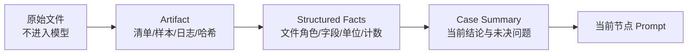

# Agent 状态机与上下文设计

> 本文定义陌生谱图 Agent Case 的状态、轮次、持久化、并发和通知语义。  
> 本文是目标设计，不表示数据库表和 API 已经实现。

## 1. 设计原则

1. **Case 是唯一上下文边界**：任何消息、产物、尝试和通知都必须属于一个 `case_id`。
2. **服务器是状态真源**：浏览器 `localStorage` 只能保存最近打开的 Case，不保存权威上下文。
3. **确定性状态机控制 Agent**：模型不能自行增加轮次、跳过用户或声明最终成功。
4. **Checkpoint 不等于业务记录**：LangGraph checkpoint 用于恢复执行，Viewer 表用于查询、审计和 UI。
5. **大文件不进入模型上下文**：模型只接收结构化清单、有限样本和带哈希的产物引用。
6. **同一 Case 单写**：任一时刻只允许一个 Worker 推进状态。
7. **用户输入不可丢失**：每次回答带幂等键、上下文版本和服务器消息序号。
8. **没有登录就不声称用户隔离**：第一阶段是单工作区，而不是多用户系统。

## 2. 状态定义

### 2.1 Case 主状态

| 状态 | 含义 | 是否可执行 | 是否计入红色角标 |
| --- | --- | --- | --- |
| `CREATED` | Case 已建立，等待 Worker | 是 | 否 |
| `ANALYZING` | Agent 1 正在分析或复盘 | 是 | 否 |
| `STRATEGY_READY` | 已生成可执行策略 | 是 | 否 |
| `BUILDING` | Agent 2 正在生成候选实现 | 是 | 否 |
| `VERIFYING` | 确定性验证节点正在运行（含 `.zp` deep validation、Viewer staging import、API DTO 与可视化数据检查） | 是 | 否 |
| `NEEDS_USER` | 等待用户回答或确认 | 否 | 是 |
| `ACCEPTANCE_CHECK` | 验证已通过，将已校验的 staging 结果提交为持久数据集 | 是 | 否 |
| `READY_FOR_REVIEW` | 技术门禁通过，等待人工接纳公共 adapter | 否 | 否（独立 `REVIEW_REQUIRED` 通知，不计红色角标） |
| `SUCCESS` | 当前数据集已成功导入 | 否 | 否 |
| `FAILED` | 不可恢复的系统或安全失败 | 否 | 否（独立 `FAILED` 通知，不计红色角标） |
| `STOPPING` | 收到停止请求，等待安全点 | 仅清理 | 否 |
| `STOPPED` | 用户停止或系统安全停止 | 否 | 否 |

### 2.2 状态图



## 3. 尝试规则

### 3.1 首次自主阶段

Case 初始：

```text
interaction_mode = autonomous
autonomous_attempt_limit = 3
autonomous_attempt_used = 0
guided_attempt_no = 0
```

一次自主尝试包含：

1. Agent 1 生成或修订策略。
2. Agent 2 生成候选代码。
3. 运行代码范围检查。
4. 运行 `.zp` 测试与样本转换。
5. 运行 deep validation。
6. 运行 Viewer staging import、API 契约检查与可视化数据可用性检查。
7. Agent 1 根据确定性报告生成下一步说明。

每次自主验证以失败结束时，先执行 `autonomous_attempt_used += 1`，再按下表路由：

- `autonomous_attempt_used < 3`：允许自动进入下一轮。
- `autonomous_attempt_used == 3`：必须进入 `NEEDS_USER`。

### 3.2 用户驱动阶段

三轮自主机会耗尽后：

```text
interaction_mode = guided
```

用户每次回答产生：

```text
context_revision += 1
guided_attempt_no += 1
guided_attempt_budget = 1
```

这一轮失败后：

- 不恢复三轮自主机会。
- Agent 1 必须基于新失败证据生成新的具体问题。
- Case 立即回到 `NEEDS_USER`。

这一轮验证通过后：

- 进入 `ACCEPTANCE_CHECK` 完成持久化提交（不重跑验证）。
- 提交成功后才进入 `SUCCESS` 或 `READY_FOR_REVIEW`；提交失败按状态图回到 `NEEDS_USER`。

### 3.3 轮次伪代码

```python
if verification_passed:
    next_state = "ACCEPTANCE_CHECK"
elif interaction_mode == "autonomous":
    autonomous_attempt_used += 1
    next_state = "ANALYZING" if autonomous_attempt_used < 3 else "NEEDS_USER"
else:
    next_state = "NEEDS_USER"
```

用户回答时：

```python
assert case.state == "NEEDS_USER"
case.context_revision += 1
case.interaction_mode = "guided"
case.guided_attempt_no += 1
case.state = "ANALYZING"
```

## 4. LangGraph 状态

建议使用显式 `StateGraph`，不使用自由运行的通用 supervisor loop。

```python
class AgentImportState(TypedDict):
    case_id: str
    workspace_id: str
    source_mode: Literal["LOCAL_PATH", "MANAGED_UPLOAD"]
    source_root_ref: str
    dataset_fingerprint: str
    selected_analysis_type: str
    user_hint: str | None

    status: str
    interaction_mode: Literal["autonomous", "guided"]
    autonomous_attempt_used: int
    guided_attempt_no: int
    context_revision: int

    strategy_artifact_id: str | None
    candidate_artifact_id: str | None
    verification_artifact_id: str | None
    pending_question_id: str | None

    last_error_code: str | None
    stop_requested: bool
```

不要把以下内容直接存入 graph state：

- 完整 RAW、mzML、Parquet、PFMB 或 `.zp` 内容。
- 完整源代码仓库快照。
- 超大 stdout/stderr。
- 数据库连接字符串、API key、`.env`。

Graph state 只保存不可变产物 ID、摘要、哈希和状态字段。

### 4.1 建议节点

```text
claim_case
→ assemble_context
→ analyze_source
→ validate_strategy
→ build_candidate
→ inspect_diff
→ run_binary_tests
→ convert_sample
→ deep_validate_zp
→ staging_import
→ verify_viewer_contract
→ review_evidence
→ route_after_verification
→ interrupt_for_user / acceptance / success
```

### 4.2 节点副作用

节点执行应满足：

- 同一输入重复执行时结果可识别。
- 写文件使用 Case 专属路径。
- 数据库写入带 `case_id + operation_id` 幂等键。
- `interrupt()` 之前完成的副作用必须已经提交并可重放检查。
- 节点只返回小型、可序列化状态。

## 5. PostgreSQL 业务表草案

LangGraph checkpointer 可以使用独立表或 schema。以下是 Viewer 仍需维护的业务表。

### 5.1 `agent_import_cases`

| 字段 | 类型 | 说明 |
| --- | --- | --- |
| `case_id` | UUID PK | Case 唯一标识，同时作为 LangGraph `thread_id` |
| `workspace_id` | TEXT | 第一阶段固定为部署级工作区 |
| `status` | TEXT | Case 主状态 |
| `source_mode` | TEXT | `LOCAL_PATH` / `MANAGED_UPLOAD` |
| `source_ref` | TEXT | 受控路径引用，不向前端暴露任意绝对路径 |
| `dataset_fingerprint` | CHAR(32) | Viewer metadata manifest MD5 |
| `selected_analysis_type` | TEXT | 用户选择的大类 |
| `user_hint` | TEXT NULL | 用户初始简短说明 |
| `interaction_mode` | TEXT | `autonomous` / `guided` |
| `autonomous_attempt_used` | INT | 0..3 |
| `guided_attempt_no` | INT | 用户回答后的单轮次数 |
| `context_revision` | INT | 用户补充后递增 |
| `version` | BIGINT | 乐观并发版本 |
| `lease_owner` | TEXT NULL | 当前 Worker |
| `lease_expires_at` | TIMESTAMPTZ NULL | 执行租约 |
| `stop_requested_at` | TIMESTAMPTZ NULL | 停止请求 |
| `created_at` | TIMESTAMPTZ | 创建时间 |
| `updated_at` | TIMESTAMPTZ | 更新时间 |

建议约束：

```text
0 <= autonomous_attempt_used <= 3
context_revision >= 1
guided_attempt_no >= 0
```

### 5.2 `agent_attempts`

| 字段 | 说明 |
| --- | --- |
| `attempt_id` | 尝试唯一标识 |
| `case_id` | 所属 Case |
| `attempt_kind` | `AUTONOMOUS` / `GUIDED` |
| `attempt_no` | 对应阶段内序号 |
| `context_revision` | 使用的上下文版本 |
| `base_repo_commit` | 候选代码基线 |
| `strategy_artifact_id` | 策略 |
| `candidate_artifact_id` | 代码差异与测试 |
| `verification_artifact_id` | 验证报告 |
| `result` | `RUNNING` / `PASSED` / `FAILED` / `CANCELLED` |
| `failure_code` | 稳定错误码 |
| `started_at/finished_at` | 时间 |

唯一约束建议：

```text
UNIQUE(case_id, attempt_kind, attempt_no)
```

### 5.3 `agent_messages`

| 字段 | 说明 |
| --- | --- |
| `message_id` | UUID |
| `case_id` | 所属 Case |
| `sequence_no` | Case 内服务器单调递增序号 |
| `context_revision` | 消息对应上下文 |
| `sender_type` | `USER` / `AGENT_1` / `AGENT_2` / `SYSTEM` |
| `message_kind` | `TEXT` / `QUESTION` / `STATUS` / `EVIDENCE` |
| `content` | 面向用户的正文 |
| `structured_payload` | 小型 JSONB |
| `idempotency_key` | 用户提交幂等键 |
| `created_at` | 时间 |

唯一约束建议：

```text
UNIQUE(case_id, sequence_no)
UNIQUE(case_id, idempotency_key) WHERE idempotency_key IS NOT NULL
```

### 5.4 `agent_artifacts`

只保存产物元数据，不把大二进制放入 PostgreSQL：

| 字段 | 说明 |
| --- | --- |
| `artifact_id` | UUID |
| `case_id` | 所属 Case |
| `attempt_id` | 可选尝试 |
| `artifact_type` | manifest、sample、strategy、patch、log、zp、certificate 等 |
| `storage_ref` | Case 目录中的受控相对引用 |
| `sha256` | 内容哈希 |
| `size_bytes` | 大小 |
| `media_type` | 类型 |
| `created_at` | 时间 |

### 5.5 `agent_notifications`

| 字段 | 说明 |
| --- | --- |
| `notification_id` | UUID |
| `case_id` | 所属 Case |
| `kind` | `NEEDS_USER` / `REVIEW_REQUIRED` / `FAILED` |
| `active` | 是否仍需处理 |
| `title` | 标题 |
| `summary` | 一行摘要 |
| `created_at/resolved_at` | 时间 |

第一阶段红色角标：

```sql
COUNT(*) WHERE active = TRUE AND kind = 'NEEDS_USER'
```

没有登录系统时不设计 `user_id` 和用户级 `read_at`；否则会制造错误的隔离承诺。

## 6. 上下文管理

### 6.1 上下文分层



### 6.2 固定上下文

每轮都可以引用但不重复全文传输：

- Viewer 导入架构边界摘要。
- `.zp` guardrails 摘要。
- 固定 commit 和允许修改路径。
- 允许命令和禁止命令。
- JSON 输出 schema。
- 当前分析大类。

### 6.3 Case 上下文

- 数据集 metadata fingerprint。
- 文件清单及角色推断。
- 有界文件头和字段样本。
- 用户初始说明。
- 已确认事实与不确定事实。
- 历史失败的稳定错误码。
- 最新策略和候选版本。

### 6.4 轮次上下文

每次只注入：

- 上一轮失败摘要。
- 最小必要日志片段。
- 修改过的文件差异。
- 当前确定性验证结果。
- 最新用户回答。

禁止把完整历史对话每轮原样重放。每次验证结束生成新的结构化 summary；旧日志通过 artifact ID 按需读取。

### 6.5 文件抽样

Agent 工具应提供窄接口，例如：

```text
list_manifest(max_entries, depth)
read_text_sample(relative_path, start, max_bytes)
inspect_tabular_schema(relative_path, max_rows)
inspect_xml_tags(relative_path, max_events)
inspect_mzml_metadata(relative_path)
inspect_binary_header(relative_path, max_bytes)
```

规则：

- 路径必须在 Case `source_root` 内。
- 不跟随符号链接或 junction。
- 默认不读取完整大文件。
- 返回内容标注截断状态、字节范围和文件哈希。
- pickle 等不安全格式不得直接反序列化。

## 7. 多电脑并发

### 7.1 可以解决的问题

即使没有用户登录，也可以保证：

- Case A 的消息不会写入 Case B。
- 两台电脑打开同一 Case 时看到相同服务器消息顺序。
- 同一用户回答重试不会生成两次尝试。
- 同一 Case 不会被两个 Worker 同时推进。
- 页面刷新不会丢失任务。

### 7.2 无法解决的问题

没有身份系统时无法保证：

- 不同用户互相看不到 Case。
- 通知已读状态按用户区分。
- 谁回答了问题。
- 谁可以停止、批准或查看代码。
- 模型费用归属于哪个用户或团队。

第一阶段前端应明确显示“共享工作区”，而不是显示虚假的用户名。

### 7.3 乐观并发

用户提交回答：

```http
POST /api/v1/agent-import-cases/{case_id}/messages
If-Match: "<case.version>"
Idempotency-Key: "<uuid>"
```

服务端只有在以下条件同时满足时接受：

- Case 为 `NEEDS_USER`。
- 客户端版本等于当前版本。
- 当前问题 ID 一致。
- 幂等键未使用。

版本冲突返回 `409 AGENT_CASE_VERSION_CONFLICT`，前端刷新 Case 后再显示最新状态。

### 7.4 Worker 租约

领取 Case：

```text
BEGIN
SELECT ... FOR UPDATE SKIP LOCKED
UPDATE lease_owner, lease_expires_at, version
COMMIT
```

Worker 运行期间周期续租。租约到期后，其他 Worker 可以从 LangGraph checkpoint 恢复，但必须先检查当前 attempt 是否已有完成产物，避免重复副作用。

## 8. 通知语义

### 8.1 产生通知

仅以下情况默认产生红色角标：

- 三轮自主失败，需要用户回答。
- guided 单轮失败，需要用户再次回答。
- Agent 发现科学语义无法安全推断，需要用户确认。

普通状态变化不计数：

- 分析中。
- 生成代码中。
- 测试中。
- 导入中。
- 成功。

### 8.2 解除通知

在同一事务中：

1. 接受用户回答。
2. 旧 `NEEDS_USER` notification 设为 inactive。
3. Case 进入 `ANALYZING`。
4. 创建 guided attempt。
5. `context_revision` 和 `version` 递增。

不能在用户仅打开抽屉时解除，因为“看过”不等于“已经回答”。

## 9. API 草案

| 方法 | 路径 | 用途 |
| --- | --- | --- |
| `POST` | `/agent-import-cases` | 内部创建 Case，通常由 planner fallback 调用 |
| `GET` | `/agent-import-cases` | 列表与状态筛选 |
| `GET` | `/agent-import-cases/{case_id}` | Case 摘要 |
| `GET` | `/agent-import-cases/{case_id}/messages` | 按序号分页获取消息 |
| `POST` | `/agent-import-cases/{case_id}/messages` | 提交用户回答 |
| `POST` | `/agent-import-cases/{case_id}/stop` | 请求安全停止 |
| `GET` | `/agent-import-cases/{case_id}/attempts` | 尝试与验证摘要 |
| `GET` | `/agent-import-cases/{case_id}/artifacts` | 允许展示的产物元数据 |
| `GET` | `/agent-notifications/count` | `NEEDS_USER` 数量 |
| `GET` | `/agent-notifications` | 活跃通知列表 |
| `GET` | `/agent-events` | 可选 SSE 状态事件 |

所有 route 只做 schema、权限/工作区、lookup 和 service 调用，不在 route 内运行 Agent、扫描大文件或执行转换。

## 10. 停止语义

用户点击停止后：

1. 设置 `stop_requested_at`。
2. Case 进入 `STOPPING`。
3. Worker 在安全点检查停止标志。
4. 终止 Agent 后续节点。
5. 只清理 Case 拥有的临时文件。
6. 保留消息、策略、验证摘要和审计记录。
7. 不删除本地模式源文件。
8. 服务器上传文件是否清理由现有 managed upload 所有权规则决定，不能只根据 Case 路径删除。

不能用强制杀线程模拟可靠停止。正在运行的外部转换器需要单独的进程句柄、超时和终止策略。

## 11. 故障恢复

| 故障 | 恢复方式 |
| --- | --- |
| 浏览器关闭 | Case 不受影响；重新查询服务器 |
| FastAPI 重启 | Worker 和 checkpoint 独立；API 恢复后查询 |
| Worker 崩溃 | 租约到期后从 checkpoint 恢复 |
| 模型请求失败 | 当前节点按有限重试策略；不消耗科学修复轮次 |
| Agent 输出 JSON 无效 | 同节点格式修复；超过限制记基础设施失败 |
| 转换进程超时 | 记录稳定错误码，清理自有临时文件 |
| 验证失败 | 计入一次科学修复尝试 |
| PostgreSQL 暂时不可用 | 不继续产生副作用；恢复后重领 Case |
| 源数据被修改 | 停止并返回 `SOURCE_CHANGED`，不得继续 |

“模型服务不可用”和“转换策略错误”必须分开计数，不能因为网络错误浪费三次自主科学尝试。

## 12. 测试要求

### 12.1 状态机

- 第 1、2 次自主失败会自动继续。
- 第 3 次自主失败必定进入 `NEEDS_USER`。
- 用户回答后只产生一个 guided attempt。
- guided attempt 失败后立即再次 `NEEDS_USER`。
- 用户回答不会重置自主次数。
- 成功必须先经过 `ACCEPTANCE_CHECK`。
- `STOPPING` 最终只进入 `STOPPED` 或明确的停止失败状态。

### 12.2 并发与幂等

- 两个 Worker 不能同时持有一个 Case。
- 重复提交同一幂等键只创建一条用户消息。
- 旧版本页面提交返回 409。
- 同一 Case 的 `sequence_no` 无重复且严格递增。
- 服务重启后 checkpoint 与业务状态一致。

### 12.3 上下文

- 大文件内容不进入 checkpoint。
- artifact 路径不能逃出 Case 根目录。
- 不跟随 symlink/junction。
- 日志截断规则稳定。
- 用户回答只进入对应 Case 和 context revision。

### 12.4 通知

- 只有 `NEEDS_USER` 默认增加红色计数。
- 用户回答后通知解除。
- 仅打开抽屉不解除。
- Case 停止后活跃通知解除。

## 13. 后续身份扩展

领导确认登录方案后，可在不改变 Case 核心状态机的前提下增加：

- `users`
- `organizations`
- `workspace_members`
- `case_owner_user_id`
- `notification_recipient_user_id`
- 用户级 `read_at`
- RBAC：查看、回答、停止、批准、管理

迁移前第一阶段的 Case 可归入一个明确的 `legacy_shared_workspace`，不能静默分配给任意首位用户。

## 14. 相关文档

- [陌生谱图Agent总体设计.md](陌生谱图Agent总体设计.md)
- [ZP转换接入与安全边界.md](ZP转换接入与安全边界.md)
- [陌生谱图Agent交互原型.html](陌生谱图Agent交互原型.html)
