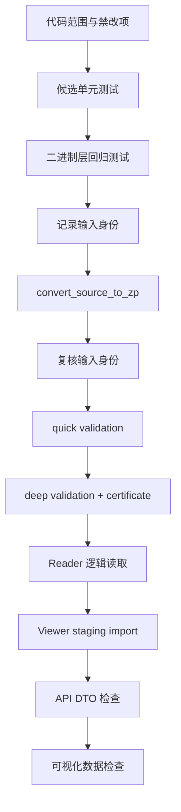

# ZP 转换接入与安全边界

> 本文定义 Agent 如何参考并扩展 `E:\viewer-two` 的 `.zp` 二进制中间层，以及 Viewer 如何在未来读取经过验证的 `.zp`。  
> 本文不修改 `.zp` 规范，也不表示 Viewer 集成已经实现。

## 1. 基线事实

`E:\viewer-two` 是独立 Python 包 `zp-binary-layer`，当前公开能力包括：

- `inspect_source(...)`
- `convert_source_to_zp(...)`
- `validate_zp(...)`
- `open_zp(...)`
- `SourceInspector`
- `PlanBuilder`
- `StepRegistry`
- `PipelineRunner`
- `ZpWriter`
- `ZpReader`
- `ZpValidator`

其架构约束是 Agent 的强制边界：

1. `BaseBlockTool` 只能创建或更新 typed blocks。
2. `BaseBlockTool` 不能写 `.zp`、不能设置输出路径、不能调用 validator。
3. `PipelineRunner` 不能根据 source type、MS level 或鉴定类型分支。
4. `StepRegistry` 只注册和查找 named step，不负责选择计划。
5. `ZpWriter` 是唯一允许写最终 `.zp` 的生产组件。
6. Writer 不能修补缺失的业务 block、index、string pool 或引用。
7. v1 冻结格式不能被静默重新解释。
8. 核心 block 字段变化必须进入版本评审。
9. Validator 不能为了让测试通过而放宽。
10. `viewer-two` 不能依赖 Viewer、前端或数据库。

## 2. 当前开发状态警戒

只读检查显示 `E:\viewer-two` 当前存在未提交的 v3 相关开发改动和测试资产。这意味着：

- 当前目录不是 Agent 可用的稳定基线。
- 文档不能把 v3 写成已发布格式。
- Agent 不得在该目录上直接创建分支、改文件或运行清理。
- 正式接入前必须由二进制层负责人指定一个 clean commit。
- 每个 Case 记录完整 `base_repo_commit`。
- 候选差异只能基于该 commit 的临时 worktree。

建议配置：

```text
ZP_BINARY_REPOSITORY=<只读仓库或受控镜像>
ZP_BINARY_BASE_COMMIT=<人工批准的完整 commit SHA>
ZP_BINARY_DEFAULT_FORMAT_VERSION=<人工批准的版本>
```

Agent 不能修改上述配置。

## 3. 转换总体流程


“转换成功”只表示生成候选文件，不表示导入成功。至少完成 deep validation 和 Viewer staging import 后才能进入验收。

## 4. Agent 1 输出契约

Agent 1 必须输出结构化 `ImportStrategy`，不能只输出说明文字。

### 4.1 示例

```json
{
  "schema_version": 1,
  "case_id": "4b8e8d6b-3f0c-4f5e-bf75-2de57ef4b322",
  "context_revision": 1,
  "selected_analysis_type": "BOTTOM_UP",
  "proposed_source_type": "real_vendor_x_dia_bundle",
  "confidence": 0.87,
  "evidence": [
    {
      "artifact_ref": "manifest/file-17",
      "fact": "主结果表包含 precursor、RT、q-value 和 protein group 字段"
    },
    {
      "artifact_ref": "sample/schema-3",
      "fact": "谱图文件为单 run centroid mzML"
    }
  ],
  "source_roles": [
    {
      "role": "primary_identification",
      "pattern": "*.parquet",
      "cardinality": "exactly_one",
      "required": true
    },
    {
      "role": "spectrum_source",
      "pattern": "*.mzML",
      "cardinality": "exactly_one",
      "required": true
    }
  ],
  "scientific_mapping": {
    "run_identity": "report.Run normalized against mzML run id",
    "retention_time_unit": "minutes",
    "spectrum_association": "closed isolation bounds plus nearest RT",
    "identification_level": "precursor"
  },
  "reuse_plan": {
    "core_spectra": "RealMzmlParseTool",
    "writer": "ZpWriter",
    "physical_validator": "ZpValidator",
    "viewer_components": [
      "BuSpectrumChart",
      "BuXicChart",
      "BuChromatogramChart"
    ]
  },
  "required_changes": [
    "new bundle inspector",
    "new source profile",
    "new versioned Extension schema",
    "new BaseBlockTool",
    "PlanBuilder mapping",
    "StepRegistry registration",
    "domain validator",
    "reader facade methods",
    "tests and documentation"
  ],
  "format_decision": "EXTENSION_ONLY",
  "unknowns": [],
  "user_questions": []
}
```

### 4.2 必需字段

| 字段 | 说明 |
| --- | --- |
| `schema_version` | 策略契约版本 |
| `case_id` | Case |
| `context_revision` | 使用的用户上下文 |
| `proposed_source_type` | 新 source profile 名 |
| `evidence` | 每个关键判断的证据引用 |
| `source_roles` | 输入角色与基数 |
| `scientific_mapping` | 单位、关联、run、谱图和鉴定语义 |
| `reuse_plan` | 复用现有步骤、Reader、Viewer 组件 |
| `required_changes` | 最小修改清单 |
| `format_decision` | `NO_FORMAT_CHANGE` / `EXTENSION_ONLY` / `FORMAT_REVIEW_REQUIRED` |
| `unknowns` | 尚不确定事实 |
| `user_questions` | 需要用户回答的问题 |

### 4.3 策略拒绝条件

以下情况不能进入 Agent 2：

- 输入角色基数不明确。
- RT、m/z、charge 等关键单位无法确定。
- 文件关联方式没有证据。
- 需要从不受信 pickle 反序列化。
- 需要丢弃未知列或未知数组才能继续。
- 用户选择与文件证据冲突且无法解释。
- 要求修改核心 block，但没有 `FORMAT_REVIEW_REQUIRED`。
- 计划绕过 `ZpWriter` 或 validator。

## 5. Agent 2 输出契约

Agent 2 产出 `CandidateImplementation`：

```json
{
  "schema_version": 1,
  "case_id": "4b8e8d6b-3f0c-4f5e-bf75-2de57ef4b322",
  "attempt_id": "c5d4ee2c-4ea4-4d4f-929d-cf61f9418303",
  "base_repo_commit": "full-commit-sha",
  "changed_files": [
    "binary_layer/vendor_x_bundle.py",
    "binary_layer/vendor_x_schema.py",
    "binary_layer/tools/real_vendor_x.py",
    "binary_layer/plan.py",
    "binary_layer/registry.py",
    "tests/test_real_vendor_x.py",
    "README.md"
  ],
  "forbidden_files_changed": [],
  "new_source_type": "real_vendor_x_dia_bundle",
  "new_step_names": ["real_vendor_x_dia"],
  "format_change": false,
  "test_commands": ["python -m pytest tests/test_real_vendor_x.py"],
  "artifacts": {
    "patch": "artifact://candidate/patch",
    "test_report": "artifact://candidate/test-report"
  }
}
```

确定性差异检查必须验证：

- 所有修改都在允许路径。
- 没有 `.env`、密钥、数据库文件或原始数据。
- 没有修改源数据。
- 没有新增第二个 Writer。
- 没有在 Runner/Registry 中增加业务判断。
- 没有把 Viewer 依赖引入 `viewer-two`。
- 没有删除或跳过 validator。
- 没有改动基础 commit 以外的未跟踪开发文件。

## 6. 候选代码允许修改范围

### 6.1 常规新格式

Agent 可以提出：

| 模块 | 允许变化 |
| --- | --- |
| inspector/bundle | 新输入布局检测、角色和基数 |
| schema | 新 versioned Extension schema |
| adapter | 外部字段到 typed block/Extension 的映射 |
| `tools/` | 新 `BaseBlockTool` |
| plan | 新 `source_type -> 固定 named steps` 映射 |
| registry | 注册新的 named step |
| reader | 新业务 Extension 的公开逻辑读取接口 |
| validator | 新业务 Extension 的严格验证器 |
| tests | happy path、边界、corruption、原子性 |
| README/docs | 公开行为、限制和错误码 |

### 6.2 需要人工格式评审

出现以下任一情况，Agent 停止代码生成并返回 `FORMAT_REVIEW_REQUIRED`：

- 修改九个顶层逻辑 block 的名称或顺序。
- 修改 v1 冻结 Header、directory、checksum 或 JSON 语义。
- 修改核心 block 现有字段含义。
- 新增核心字段且无法保持兼容。
- 修改 arrays encoding、dtype、endianness 或 checksum 覆盖。
- 改变 RT 单位。
- 引入压缩、内存映射或新的二进制 Extension 物理布局。
- 改变默认 Writer 版本。
- 为无法表示的源数据发明 sentinel。
- 放宽现有合法性或资源上限。

人工评审需要至少回答：

1. 能否用 versioned Extension 表达？
2. 是否必须增加 `.zp` 顶层或子格式版本？
3. v1/v2 兼容如何保证？
4. Reader、Writer、Validator、Migration 和 Golden fixture 如何同步？
5. Viewer 能否在旧版本上稳定降级？

## 7. Sandbox 设计

### 7.1 目录

```text
.viewer-agent/
└─ cases/<case_id>/
   ├─ source-view/          只读源数据视图
   ├─ repo/                 固定 commit 的临时 worktree
   ├─ work/
   │  ├─ intermediate/
   │  └─ logs/
   ├─ output/
   │  ├─ candidate.zp
   │  └─ validation-certificate.json
   └─ artifacts/
      ├─ strategy.json
      ├─ candidate.json
      ├─ patch.diff
      └─ verification.json
```

### 7.2 权限

- `source-view`：只读。
- `repo`：仅当前 Case 可写。
- `work/output/artifacts`：仅当前 Case 可写。
- Viewer 正式仓库：只读。
- `E:\viewer-two` 开发工作区：只读且不作为运行基线。
- 正式数据库：Agent 2无连接权限。
- staging database/schema：只通过受控验证工具访问。
- 网络：默认关闭；模型调用由编排层完成，不把通用网络能力交给代码 sandbox。

### 7.3 命令允许名单

第一阶段只允许明确模板化命令，例如：

```text
python -m pytest <受控测试路径>
python <受控检查脚本> <Case 内输入> <Case 内输出>
```

禁止：

- 任意 shell 字符串拼接。
- `shell=True`。
- 包管理器动态安装任意依赖。
- Git push、remote 修改或凭据读取。
- 任意数据库 CLI。
- 访问 Case 根目录以外的写路径。
- 删除仓库根、用户目录、数据根或共享上传目录。

## 8. `.zp` 转换验证

### 8.1 固定验证阶段



### 8.2 Deep validation 是硬门禁

Quick validation 适合日常完整性检查，但不能代替科学语义验证。Agent 产物必须：

- `validate_zp(path, mode="deep")` 返回 valid。
- 生成可关联的 deep-validation certificate。
- 记录 `.zp` SHA-256、格式版本、大小和验证耗时。
- 保留 validation issue 的稳定错误码。

### 8.3 原子性

- 源文件始终只读。
- 目标文件不得已存在。
- 转换写 Case 内临时文件。
- 完整验证后才能提交候选目标。
- 失败只清理 Case 自有临时文件。
- 不能覆盖源、正式 `.zp` 或其他 Case 产物。

## 9. Viewer 接入

### 9.1 依赖方向

```text
Viewer
  └─ depends on zp-binary-layer public APIs

zp-binary-layer
  └─ does not depend on Viewer, FastAPI, SQLAlchemy, frontend or database
```

禁止双向依赖。

### 9.2 `ZpImportAdapter`

建议独立模块：

```text
back/app/ingest/zp/
├─ adapter.py
├─ contracts.py
├─ mappings/
│  ├─ top_down.py
│  ├─ bottom_up.py
│  └─ spectra_only.py
└─ validation.py
```

职责：

1. 打开已经 deep validation 通过的 `.zp`。
2. 读取 version-neutral 逻辑 API。
3. 判断 dataset mode。
4. 写入 universal schema。
5. 保存 `.zp` artifact metadata。
6. 创建 staging dataset 或正式 dataset。

不应把所有 TD、BU、spectra-only 映射放进一个巨大函数；三种业务映射保持独立。

### 9.3 `ZpSpectrumReaderService`

建议独立模块：

```text
back/app/spectrum_zp/
├─ locator.py
├─ reader_service.py
├─ cache.py
└─ contracts.py
```

职责：

- 通过 dataset/run metadata 定位 `.zp`。
- 使用公开 Reader API 读取目标 spectrum arrays。
- 转换为 Viewer 已有 DTO。
- 缓存目录或轻量索引，不跨 Reader 实例缓存所有峰数组。
- 校验文件身份变化和版本支持。

### 9.4 Dataset metadata 草案

```json
{
  "spectra_source": "zp",
  "zp": {
    "artifact_path": "managed-relative-reference",
    "format_version": 2,
    "sha256": "lowercase-sha256",
    "validation_mode": "deep",
    "validation_certificate": "managed-relative-reference",
    "binary_layer_commit": "full-commit-sha",
    "source_profile": "real_vendor_x_dia_bundle"
  }
}
```

前端不能直接接收磁盘绝对路径。

## 10. 可视化复用

转换完成后优先匹配现有 DTO：

| `.zp` 逻辑数据 | Viewer API/服务 | 可复用前端 |
| --- | --- | --- |
| spectrum m/z + intensity | 谱图 DTO | `SpectrumChart` / `BuSpectrumChart` / spectra-only `SpectrumPanel` |
| chromatogram time + intensity | chromatogram DTO | `BuChromatogramChart` |
| precursor XIC | XIC DTO | `BuXicChart` |
| product ion trace | product ion DTO | `BuProductIonXicChart` |
| Top-Down fragment matches | PrSM detail DTO | `MatchedPeakSpectrumPanel`、`FragmentationView` |
| Bottom-Up fragment Extension | BU annotation DTO | `BuFragmentTable` 或相应谱图标记 |
| PFMB | 现有 PFMB API | `BuPfmbHeatmap`，但不能与 live mzML/.zp peak 混同 |
| protein/peptide coverage | BU/TD detail DTO | 现有 sequence coverage |

只有现有 DTO 无法表达经过确认的新科学语义时，才设计新 API 和新组件。不能因为来源改为 `.zp` 就复制一套图表。

## 11. 错误分类

### 11.1 用户可补充

- `SOURCE_ROLE_UNKNOWN`
- `UNIT_AMBIGUOUS`
- `RUN_ASSOCIATION_AMBIGUOUS`
- `MISSING_REQUIRED_COMPANION_FILE`
- `SCIENTIFIC_SEMANTIC_UNKNOWN`

这些错误进入 `NEEDS_USER`。

### 11.2 Agent 可自主修复

- `ADAPTER_FIELD_MAPPING_FAILED`
- `SCHEMA_VALIDATION_FAILED`
- `REFERENCE_INTEGRITY_FAILED`
- `TEST_EXPECTATION_MISMATCH`
- `VIEWER_STAGING_MAPPING_FAILED`

这些错误在自主阶段可继续下一轮。

### 11.3 必须人工工程评审

- `FORMAT_REVIEW_REQUIRED`
- `VALIDATOR_CHANGE_REQUESTED`
- `CORE_BLOCK_CHANGE_REQUIRED`
- `DEFAULT_VERSION_CHANGE_REQUIRED`
- `NEW_BINARY_ENCODING_REQUIRED`

这些错误不能继续消耗自动轮次。

### 11.4 基础设施

- `MODEL_PROVIDER_UNAVAILABLE`
- `WORKER_LEASE_LOST`
- `DATABASE_UNAVAILABLE`
- `SANDBOX_START_FAILED`
- `DISK_SPACE_LOW`

基础设施错误不计入三次科学修复轮次。

## 12. 测试矩阵

### 12.1 二进制层

- 新 inspector 的真/假布局。
- 文件角色缺失、多余和歧义。
- 单位与 run identity。
- typed mapping。
- Extension schema。
- BlockTool 边界。
- plan 固定 named steps。
- registry 只注册不决策。
- Writer 唯一性。
- v1/v2 已有回归。
- corruption 和 checksum。
- deep validator 业务关系。
- 原子失败与源文件不变。

### 12.2 Viewer bridge

- `.zp` metadata 定位。
- TD/BU/spectra-only mapping。
- staging dataset 不出现在正常列表。
- 失败时清理 staging DB，不删除源文件。
- spectrum target read。
- DTO 与当前前端类型兼容。
- `.zp` stale/identity 变化。
- 不支持版本明确失败。

### 12.3 Agent 安全

- 修改禁止路径会在执行前失败。
- 修改 validator 会进入人工评审。
- symlink/junction 逃逸失败。
- 任意 shell 参数失败。
- Agent 无法连接正式 DB。
- Agent 无法覆盖现有 target。
- Agent 无法读取 `.env` 或仓库外密钥。

## 13. 接纳与复用

一个 Case 成功不等于新格式自动成为公共格式。

公共接纳流程：

1. 当前数据集候选 `.zp` 和 Viewer staging import 通过。
2. 保存完整策略、patch、测试和证书。
3. 二进制层负责人审查格式边界。
4. Viewer 负责人审查 ingest 和 DTO 映射。
5. 在干净分支重放 patch。
6. 运行完整测试矩阵。
7. 人工提交并发布版本。
8. Viewer 锁定新的二进制层版本。
9. 把新 source type 接入确定性 planner。
10. 后续相同格式不再触发 Agent。

## 14. 相关文档

- [陌生谱图Agent总体设计.md](陌生谱图Agent总体设计.md)
- [Agent状态机与上下文设计.md](Agent状态机与上下文设计.md)
- [陌生谱图Agent交互原型.html](陌生谱图Agent交互原型.html)
- `E:\viewer-two\README.md`
- `E:\viewer-two\AGENTS.md`
- `E:\viewer-two\docs\ZP_V2_BINARY_ARRAY_FORMAT_SPEC.md`
- `E:\viewer-two\docs\ZP_V2_COMPATIBILITY_AND_MIGRATION.md`
