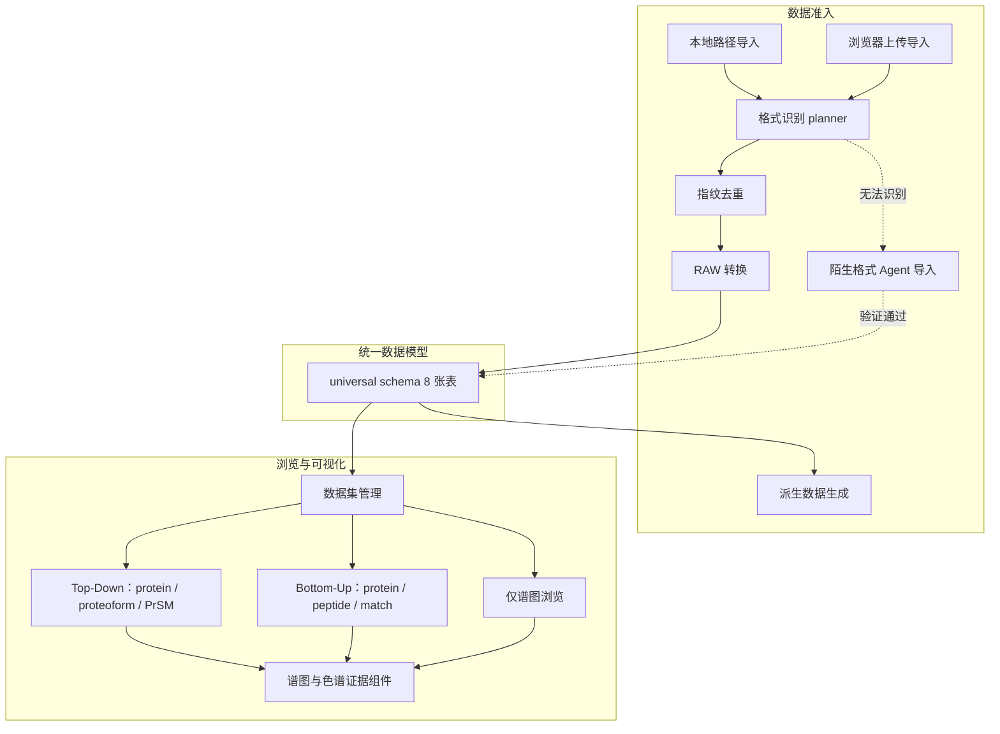

# Viewer 产品需求文档（PRD）

> 文档版本：v1.0　　编写日期：2026-07-29　　文档性质：**内部工程文档**
> 覆盖范围：**已实现功能 + 已规划未实现功能**，每条需求均标注实现状态。
> 配套文档：[需求规格说明书SRS.md](需求规格说明书SRS.md)、[项目开发计划.md](项目开发计划.md)

---

## 0. 阅读约定

### 0.1 实现状态标记

本文所有功能条目使用统一状态标记，状态判定以**仓库当前代码**为准，而非以既有规划文档的意图为准。

| 标记 | 含义 | 判定依据 |
| --- | --- | --- |
| **[已实现]** | 代码已存在、有对应接口/页面、有测试覆盖 | 后端 router / 前端 page 存在且被路由挂载 |
| **[部分实现]** | 主链路可用，但存在明确的能力缺口或降级路径 | 代码存在但有 `404`/`409` 降级分支或格式限制 |
| **[规划中]** | 仅有设计文档，代码不存在 | 仅在 `docs/` 下有设计稿 |

### 0.2 优先级

| 标记 | 含义 |
| --- | --- |
| **P0** | 核心链路，缺失则产品不可用 |
| **P1** | 重要能力，缺失显著降低产品价值 |
| **P2** | 增强能力，可延后 |

### 0.3 术语表

| 术语 | 说明 |
| --- | --- |
| TD（Top-Down） | 自上而下蛋白质组学，直接分析完整蛋白，产物为 proteoform 与 PrSM |
| BU（Bottom-Up） | 自下而上蛋白质组学，酶解为肽段后分析，产物为 peptide 与 PSM |
| PrSM | Proteoform-Spectrum Match，蛋白形式与谱图的匹配 |
| proteoform | 蛋白形式，同一基因产物的一种具体修饰/剪切状态 |
| cutoff | TopPIC 输出的两套过滤结果集（`prsm` / `proteoform`），本产品中为「虚拟 cutoff」 |
| run | 一次质谱采集，对应一个原始数据文件 |
| XIC | Extracted Ion Chromatogram，提取离子色谱 |
| TIC / BPC | 总离子流图 / 基峰色谱图 |
| DIA / DDA | 数据非依赖采集 / 数据依赖采集 |
| PFMB | Pre-computed Fragment Match Bundle，预计算碎片匹配二进制侧车文件 |
| 指纹 | 数据集元数据清单的 MD5（`相对路径\|size\|mtime`），用于重复导入识别 |
| `.zp` | `E:\viewer-two` 提供的质谱二进制中间层格式 |
| Case | 陌生谱图 Agent 的一次导入会话，是唯一上下文边界 |

---

## 1. 产品定位

### 1.1 一句话定位

Viewer 是一个**本地/私有部署的质谱蛋白质组学结果浏览与证据核查平台**：把各类质谱鉴定软件产生的异构结果目录，统一收敛为一套数据模型，并提供从数据集总览到单个谱图峰级证据的可视化下钻。

### 1.2 要解决的核心问题

质谱数据分析工具（TopPIC、DIA-NN、DIA-CLIP 等）各自输出**结构迥异的结果目录**——有的是几万个 JS 文件组成的 HTML 报告树，有的是单个 Parquet 表加一批 mzML，有的还需要先把厂商原始格式转换成开放格式。研究者要核查一条鉴定结果是否可信，通常需要：

1. 在文件管理器里翻目录找对应的谱图文件；
2. 用另一个工具打开原始数据、手工定位 scan 号；
3. 自己算理论碎片离子、和实测峰逐个比对。

这个过程无法复用、无法分享、极易出错。Viewer 把这三步合并为「点击一条鉴定 → 直接看到叠加了匹配标注的谱图和色谱证据」。

### 1.3 产品边界

Viewer **不是**搜索引擎、不做鉴定计算、不做定量统计分析。它消费别的软件产出的鉴定结果，专注于**导入统一化**与**证据可视化**两件事。唯一的例外是碎片离子的理论 m/z 计算——这是可视化标注所必需的（`back/app/bu/services/theoretical_fragments.py`）。

---

## 2. 目标用户与角色

产品当前**没有登录与鉴权系统**，因此下述「角色」是使用场景意义上的角色，不是系统中的权限主体。这一点在需求上有直接后果，见 §7.4。

| 角色 | 关注点 | 主要使用路径 |
| --- | --- | --- |
| **研究者 / 分析人员** | 某条鉴定是否可信、修饰定位是否有谱图支持 | 数据集 → 列表 → 详情 → 谱图证据 |
| **数据管理者** | 把新一批结果导入平台、确认导入成功、清理重复数据集 | 数据集页 → 导入 → 任务进度 → 删除 |
| **平台维护者 / 二次开发者** | 新格式接入、性能与容量、故障定位 | 导入中间层、派生数据、日志与测试 |
| **格式评审人**（[规划中]） | Agent 生成的转换代码是否越界、`.zp` 格式是否被改动 | Agent Case 页 → 代码差异与验证证据 → 人工接纳 |

---

## 3. 使用场景与用户旅程

### 3.1 场景 A：Top-Down 结果核查（[已实现] P0）

一位研究者拿到一批组蛋白 Top-Down 数据的 TopPIC 分析结果，想确认某个乙酰化 proteoform 的鉴定质量。

1. 在数据集页看到该数据集卡片，标记为 Top-Down，显示 protein / proteoform / PrSM 三个计数；
2. 进入数据集，看到两张 cutoff 卡片（PrSM cutoff、Proteoform cutoff），选择其一；
3. 在 protein 列表中搜索目标蛋白，按最优 e-value 排序，点进详情；
4. 详情页列出该蛋白下的所有 proteoform，点进目标 proteoform；
5. 看到该 proteoform 的所有 PrSM，按 e-value 升序，点进最优的一条；
6. **PrSM 详情页**给出完整证据链：序列覆盖视图、MS1 谱图、叠加了匹配碎片标注的 MS2 谱图、碎片化梯形图与 ppm 误差图、匹配峰表格、LC-MS 三维视图；
7. 点击匹配峰表格中的某个离子，页面内联展开该离子附近的 MS2 局部谱图；双击图表进入全屏并可缩放。

**关键价值**：第 6 步把原本需要三个工具、半小时的核查压缩到一屏。

### 3.2 场景 B：Bottom-Up DIA 结果核查（[已实现] P0）

一位研究者拿到 DIA-NN 的 DIA 定量结果，想确认某个肽段的鉴定证据。

1. 数据集卡片标记为 Bottom-Up；进入后直接是**总览页**：QC 计数卡片、TIC/BPC 色谱图、RT–m/z 热图、DIA 隔离窗口图（Bruker 数据）；
2. 通过顶部标签切到 protein / peptide / match 三种列表，可按 q-value 上限、run、是否隐藏 decoy 过滤，过滤条件写入 URL 可分享；
3. 进入 match 详情页，看到：前体 XIC、MS1 谱图、带 b/y 离子标注的 MS2 谱图、产物离子 XIC 对比（最多 8 条）、Bruker 数据的离子迁移率切片、PFMB 预计算碎片匹配热图；
4. 在 XIC 上点击某个时间点，MS2 谱图跟随跳到该保留时间对应的扫描。

**关键价值**：DIA 数据的鉴定证据分散在色谱维度和谱图维度，第 3–4 步把两个维度联动起来。

### 3.3 场景 C：仅谱图浏览（[已实现] P1）

一位研究者只有原始采集数据（mzML 或 Thermo RAW），还没做鉴定，想先看看数据质量。

1. 导入时选择 mzML/RAW 类型，Thermo RAW 会被自动转换为 mzML；
2. 数据集卡片标记为 Spectra，进入后是**仅谱图浏览页**；
3. 选择 run，看 TIC/BPC 色谱图，浏览完整扫描索引列表；
4. 点击任一扫描查看 MS1/MS2 谱图，可切换峰标注模式；MS2 扫描可跳转到其前体 MS1 扫描。

**关键约束**：此模式**不提供任何鉴定相关 UI**，这是预期行为而非缺陷。MS2 峰标注是 TopN 强度标注，不是碎片离子归属。

### 3.4 场景 D：导入一批新数据（[已实现] P0）

1. 数据管理者在数据集页点击导入，选择分析大类与具体导入格式（8 种，见 §5.2）；
2. 两种入口：**本地路径导入**（部署在本机时，可调起系统原生文件夹选择框）或**浏览器上传**（把本地目录逐文件流式上传到服务器受控目录）；
3. 系统解析嵌套目录得到真正的导入根路径，计算元数据指纹，与已有数据集比对——重复则**直接拒绝**并指出冲突的数据集；
4. 后台任务分阶段执行：指纹 → RAW 转换 → 初始化 → 蛋白/肽段 → 匹配 → 收尾；前端轮询显示阶段名与百分比；
5. 导入成功后自动生成派生数据（mzML 扫描索引、色谱摘要、PFMB 侧车），使后续谱图查询无需全文件扫描。

### 3.5 场景 E：陌生格式导入（[规划中] P1）

这是当前唯一的重大功能缺口，也是本轮开发的目标。详见 §6.6 与 [陌生谱图Agent总体设计.md](陌生谱图Agent总体设计.md)。

一位研究者拿到某厂商的私有结果包，现有 planner 无法识别。

1. 导入时选择 `Unknown / Other` 并填一行简短说明（例如「厂商结果包，可能是 DIA」）；
2. 系统先跑完确定性 planner，确认无法识别后创建一个 **Agent Case**；
3. Agent 1 只读地扫描文件清单与抽样内容，输出结构化导入策略；Agent 2 在隔离沙箱中扩展 `.zp` 转换能力并生成测试；
4. 确定性验证器（不是 Agent）执行固定门禁：代码范围检查 → 二进制层测试 → 转换 → `.zp` 深度验证 → Viewer 暂存导入 → API 契约检查 → 可视化数据检查；
5. 首次允许最多 **3 轮**自主修复；3 轮失败后进入等待用户回答状态，左上角信息按钮出现红色角标；
6. 用户每回答一次，只允许再跑 **1 轮**；用户可随时停止；
7. 成功后复用现有谱图组件展示；新格式需**人工评审接纳**后才进入公共 planner，此后同类数据不再触发 Agent。

---

## 4. 功能地图

图中虚线为 [规划中] 部分。

---

## 5. 功能范围总览

### 5.1 三种数据集模式

产品的核心分型逻辑：一个数据集在导入时被判定为三种模式之一，模式决定了前端整套路由与页面。

| 模式 | 判定字段 | 首页 | 实体层级 | 状态 |
| --- | --- | --- | --- | --- |
| **Top-Down** | `analysis_mode = TOP_DOWN` | cutoff 卡片页 | protein → proteoform → PrSM | [已实现] |
| **Bottom-Up** | `analysis_mode = BOTTOM_UP` | 总览页（QC + 色谱 + 热图） | protein / peptide / match | [已实现] |
| **仅谱图** | `capabilities.analysis_shape` 判定 | 谱图浏览页 | run → scan | [已实现] |

前端通过三个路由守卫强制模式隔离：BU 数据集访问 TD 的 cutoff 路由会被重定向，反之亦然。

### 5.2 支持的输入格式

| 导入类型 | 输入形态 | 谱图来源 | 状态 |
| --- | --- | --- | --- |
| `TD_TOPPIC_HTML` | TopPIC HTML 输出树（`toppic_*_cutoff/data_js/`） | TopFD JS 或 mzML | [已实现] P0 |
| `TD_PRSM_BUNDLE` | 仅 `prsm*.js` 包 + mzML | mzML | [已实现] P1 |
| `TD_TOPPIC_NATIVE` | TopPIC 原生输出（XML + msalign） | mzML | [已实现] P1 |
| `TD_MZML` / `TD_RAW` | 独立 mzML / Thermo RAW | mzML | [已实现] P1 |
| `BU_DIA_NN` | DIA-NN 2.0 Parquet 报告 + run 文件 | mzML / Bruker `.d` | [已实现] P0 |
| `BU_DIA_CLIP` | DIA-CLIP 结果 TSV（复用 DIA-NN 布局） | mzML | [部分实现] P1 —— v1 仅支持单 run |
| `DDA_RAW` | DDA 原始数据 | mzML | [已实现] P2 |
| **陌生格式 → `.zp`** | 任意未识别布局 | `.zp` | **[规划中] P1** |

**明确不支持**：MGF 导入、非 Thermo 厂商 RAW 的直接转换、gzip 压缩 mzML 的随机访问、服务端 ZIP 解压导入。

### 5.3 已知能力缺口汇总

这一节是本 PRD 最重要的部分之一——它划定了「产品当前能承诺什么」。

| 缺口 | 影响 | 优先级 |
| --- | --- | --- |
| 陌生格式无法导入，只能报错 | 每种新格式都需要开发者手工写 adapter，交付周期以周计 | **P1，本轮目标** |
| Bruker `.d` 数据不支持 match 级 MS2 与 XIC | BU 的 Bruker 数据集只能看总览与列表，证据链断裂 | P1 |
| 无登录与鉴权 | 无法多用户隔离、无法审计操作、无法归属模型费用 | P1（需上级确认方案） |
| 无生产部署方案（Docker / 反向代理 / 监控） | 只能开发式启动，运维不可控 | P1 |
| API 错误响应格式不统一 | 前端需针对不同 route 写不同解析分支 | P2 |
| Top-Down 路由测试覆盖不足 | TD 链路回归风险高于 BU | P2 |
| 前端存在 `features/bu` 与 `features/bu-viewer` 重复目录 | 改一处漏一处 | P2 |
| `services/mzml_store.py` 已被谱图内存池取代但未清理 | 阅读者容易改错模块 | P2 |

---

## 6. 功能需求详述

以下按功能域组织，每条给出**产品意图**与**验收观察点**。接口级细节见 SRS。

### 6.1 数据集管理（[已实现] P0）

| 编号 | 需求 | 验收观察点 |
| --- | --- | --- |
| PR-DS-01 | 数据集列表以卡片展示，卡片上直接体现模式徽标、状态与规模计数 | TD 卡片显示三类计数；BU 卡片显示 run 数与来源软件；仅谱图卡片显示 run 数与格式 |
| PR-DS-02 | 点击卡片按模式自动进入对应首页，用户无需知道自己在看哪种模式 | 三种模式分别落到 cutoff 页 / 总览页 / 谱图页 |
| PR-DS-03 | 支持删除数据集；删除只清理数据库记录，**磁盘源数据保留** | 删除后列表消失，源目录仍在 |
| PR-DS-04 | 存在进行中的导入任务时拒绝删除，并允许用户显式选择「取消导入并删除」 | 首次删除返回冲突提示，二次确认后成功 |
| PR-DS-05 | 陈旧的僵死任务（排队超 15 分钟、运行超 120 分钟）不应阻塞删除 | 僵死任务存在时删除仍可进行 |

**设计取舍说明**：PR-DS-03 选择「不删磁盘」是有意为之——源数据往往是上游流程的唯一副本，误删代价远高于残留代价。删除接口的返回值中保留了 `deleted_disk` 字段但恒为 `false`，以便未来需要时扩展。

### 6.2 数据导入（[已实现] P0）

#### 6.2.1 两种入口

| 编号 | 需求 | 状态 | 验收观察点 |
| --- | --- | --- | --- |
| PR-IMP-01 | 本地部署时支持服务器本机路径导入，并可调起操作系统原生文件夹选择对话框 | [已实现] | 点击选择文件夹弹出系统对话框，返回路径 |
| PR-IMP-02 | 原生选择框默认**仅允许 localhost 访问**，远程访问时返回拒绝 | [已实现] | 非本机请求得到 403 |
| PR-IMP-03 | 支持浏览器选择本地整个目录并逐文件流式上传到服务器受控目录 | [已实现] | 上传会话可创建、可查询进度、可删除 |
| PR-IMP-04 | 两种入口在得到受控 `source_root` 后**汇合进入同一套导入流程** | [已实现] | 同一份数据两种入口导入结果一致 |
| PR-IMP-05 | 上传支持断点续传与 24 小时任务过期清理 | [规划中] P2 | 见 `docs/新增项目/viewer-dual-import-rework-plan.md` |

#### 6.2.2 格式识别与去重

| 编号 | 需求 | 状态 | 验收观察点 |
| --- | --- | --- | --- |
| PR-IMP-06 | 用户选择的目录可能多层嵌套，系统须自动解析出唯一的导入根路径 | [已实现] | 选择父目录、祖父目录结果一致 |
| PR-IMP-07 | 通过确定性探测器识别布局，得到导入计划；用户显式选择的类型须与实际布局校验一致 | [已实现] | 类型与布局不符时报错并说明差异 |
| PR-IMP-08 | 以**元数据指纹**（不读文件内容）识别重复导入，重复时拒绝并指出冲突数据集 | [已实现] | 同一目录二次导入被拒绝并给出已有 slug |
| PR-IMP-09 | 去重键为（指纹，导入类型）组合，同一目录以不同类型导入视为不同数据集 | [已实现] | 同目录换类型可成功导入 |
| PR-IMP-10 | 指纹计算在基准数据集上墙钟时间 **≤ 0.5 秒** | [已实现] | `cs/指纹性能测验.py` 通过 |

**为什么指纹不读文件内容**：Top-Down 的 HTML 输出树常有数万个小 JS 文件，总量可达数 GB。全文件哈希会让导入前的重复检测本身耗时数分钟，完全抵消了「快速拒绝重复」的价值。元数据清单（相对路径 + 大小 + 修改时间，排序后取 MD5）在实际使用场景下足以区分数据集，且满足 0.5 秒目标。这个取舍已记录在 `AGENTS.md`。

#### 6.2.3 任务与进度

| 编号 | 需求 | 状态 | 验收观察点 |
| --- | --- | --- | --- |
| PR-IMP-11 | 导入在后台异步执行，前端通过轮询获得状态、百分比、阶段码、可读阶段文案与细节行 | [已实现] | 大数据集导入期间进度持续推进且阶段名可读 |
| PR-IMP-12 | 任务状态为 `queued` / `running` / `success` / `failed` 四态，百分比仅在成功时为 100 | [已实现] | 失败任务不显示 100% |
| PR-IMP-13 | 浏览器刷新或关闭后重新打开，仍能恢复对进行中任务的跟踪 | [已实现] | 刷新后进度条继续 |
| PR-IMP-14 | 完成的任务记录保留 7 天后回收 | [已实现] | — |

#### 6.2.4 格式转换与派生数据

| 编号 | 需求 | 状态 | 验收观察点 |
| --- | --- | --- | --- |
| PR-IMP-15 | Thermo RAW 在导入期自动转换为索引化 mzML，转换失败即导入失败 | [已实现] | RAW 目录导入后产生 mzML 且可查谱图 |
| PR-IMP-16 | 单文件转换超时上限可配置（默认 3600 秒） | [已实现] | — |
| PR-IMP-17 | 导入成功后自动生成 mzML 扫描索引与色谱摘要侧车，使谱图查询无需全文件扫描 | [已实现] | 首次查色谱图无明显延迟 |
| PR-IMP-18 | 派生数据缺失或过期时，接口须返回可执行的补齐指令而非静默失败 | [已实现] | 返回 409 且错误详情含补齐命令 |
| PR-IMP-19 | DIA-NN 导入后自动准备 PFMB 预计算碎片匹配侧车 | [已实现] | match 详情页出现 PFMB 热图 |

### 6.3 Top-Down 浏览与可视化（[已实现] P0）

| 编号 | 需求 | 状态 | 验收观察点 |
| --- | --- | --- | --- |
| PR-TD-01 | 提供两套 cutoff 视图（PrSM cutoff / Proteoform cutoff），各自独立统计与过滤 | [已实现] | 两张卡片计数不同 |
| PR-TD-02 | protein 列表支持名称/描述搜索、分页，默认按最优 e-value 升序 | [已实现] | 搜索后重置到第一页 |
| PR-TD-03 | proteoform、PrSM 列表支持分页与按上级实体过滤 | [已实现] | 从蛋白详情进入的 proteoform 列表已过滤 |
| PR-TD-04 | PrSM 详情页须一屏内提供完整证据链：序列覆盖、MS1、MS2、碎片化视图、匹配峰表、三维视图 | [已实现] | 六个区块全部渲染 |
| PR-TD-05 | MS2 谱图须叠加匹配碎片标注；标注来自去卷积峰的单同位素 m/z 与实测峰的最近邻匹配 | [已实现] | 匹配峰高亮着色 |
| PR-TD-06 | 谱图支持纵轴百分比/绝对值切换、滚轮缩放、框选缩放、全屏与重置 | [已实现] | 全屏后缩放可用 |
| PR-TD-07 | 点击匹配峰表行，内联展开该离子邻域的 MS2 局部谱图 | [已实现] | 表格下方出现局部谱图 |
| PR-TD-08 | 谱图数据源对用户透明：TopFD JS 与 mzML 两种来源使用同一套 UI | [已实现] | 两类数据集 UI 一致 |
| PR-TD-09 | 提供 MS1 峰的三维（m/z × 强度）可视化，可轨道旋转 | [已实现] | 三维面板可拖动 |

### 6.4 Bottom-Up 浏览与可视化（[已实现] P0 / [部分实现]）

| 编号 | 需求 | 状态 | 验收观察点 |
| --- | --- | --- | --- |
| PR-BU-01 | 总览页提供 QC 计数、TIC/BPC 色谱图、RT–m/z 热图 | [已实现] | 三个区块渲染 |
| PR-BU-02 | Bruker 数据集额外提供 DIA 隔离窗口图 | [已实现] | `.d` 数据集出现窗口图 |
| PR-BU-03 | 三类列表（protein / peptide / match）支持搜索、q-value 上限、run、decoy 显隐过滤 | [已实现] | 过滤生效且计数变化 |
| PR-BU-04 | 列表过滤条件写入 URL，链接可直接分享复现 | [已实现] | 复制 URL 新窗口打开状态一致 |
| PR-BU-05 | protein 详情页提供序列覆盖可视化 | [部分实现] | DIA-NN 报告缺少肽段位置时需外部 FASTA/UniProt 补齐，离线时降级为列表 |
| PR-BU-06 | match 详情页提供前体 XIC、MS1、带 b/y 标注的 MS2 | [部分实现] | **仅 mzML run 支持**；Bruker `.d` 返回 404 |
| PR-BU-07 | 支持多条产物离子 XIC 同图对比（上限 8 条） | [已实现] | 勾选多个离子后同图显示 |
| PR-BU-08 | Bruker 数据提供离子迁移率切片视图 | [已实现] | `.d` 数据出现迁移率图 |
| PR-BU-09 | 有 PFMB 侧车时提供预计算碎片匹配热图，且**不得与实测 b/y 标注混淆呈现** | [已实现] | PFMB 区块独立标注来源 |
| PR-BU-10 | XIC 上点击时间点，MS2 谱图跟随跳转到对应保留时间的扫描 | [已实现] | 点击后 MS2 更新 |
| PR-BU-11 | DIA-CLIP 来源的数据集须有明确的来源标识与证据卡片 | [部分实现] | v1 仅支持单 run，多 run 输入被拒绝 |

**PR-BU-06 的缺口说明**：Bruker `.d` 的 match 级 MS2/XIC 需要通过 TDF 读取器按 frame 定位，与 mzML 的扫描索引路径完全不同。这是 BU 模块设计时明确延后的项（对应 `budocs/` 中的 M8 里程碑），当前 UI 会以 404 降级而非崩溃。

### 6.5 仅谱图浏览（[已实现] P1）

| 编号 | 需求 | 状态 | 验收观察点 |
| --- | --- | --- | --- |
| PR-SO-01 | 提供 run 选择、TIC/BPC 色谱图、完整扫描索引列表 | [已实现] | 三个区块渲染 |
| PR-SO-02 | 点击扫描查看 MS1/MS2 谱图，支持多种峰标注模式 | [已实现] | 切换标注模式峰标签变化 |
| PR-SO-03 | MS2 扫描可跳转到其前体 MS1 扫描，并反向列出 MS1 的子 MS2 | [已实现] | 双向跳转可用 |
| PR-SO-04 | 此模式**不得出现任何鉴定相关 UI** | [已实现] | 无蛋白/肽段入口 |
| PR-SO-05 | MS2 峰标注为 TopN 强度标注，须在 UI 上明确区别于碎片离子归属 | [已实现] | 标注说明文案正确 |

### 6.6 陌生谱图 Agent 导入（[规划中] P1）

本节是本轮开发的目标功能。完整设计见 [陌生谱图Agent总体设计.md](陌生谱图Agent总体设计.md)、[Agent状态机与上下文设计.md](Agent状态机与上下文设计.md)、[ZP转换接入与安全边界.md](ZP转换接入与安全边界.md)。此处只陈述产品需求。

#### 6.6.1 触发与前置条件

| 编号 | 需求 | 优先级 |
| --- | --- | --- |
| PR-AGT-01 | 导入类型选择中新增 `Unknown / Other`，并允许用户填一行简短说明 | P0 |
| PR-AGT-02 | 大类选择与用户说明**只用于约束探索范围，不得替代文件证据**；Agent 不能因为用户选了 BU 就强行按 BU 解释 | P0 |
| PR-AGT-03 | 进入 Agent 前必须先完成根路径解析、指纹计算、确定性 planner、类型与布局校验四步 | P0 |
| PR-AGT-04 | 缺少必需文件、slug 冲突、重复数据集等普通错误仍由现有流程直接返回，**不消耗 Agent 调用** | P0 |
| PR-AGT-05 | 每个陌生数据集创建唯一 Case | P0 |

**PR-AGT-04 的动机**：大模型调用有真实成本。把「用户少放了一个文件」这类确定性错误交给 Agent 去探索，既慢又贵且结论不稳定。

#### 6.6.2 交互与通知

| 编号 | 需求 | 优先级 |
| --- | --- | --- |
| PR-AGT-06 | 界面左上角提供常驻信息按钮，红色角标数字**仅统计等待用户回答的 Case 数量**，为零时隐藏 | P0 |
| PR-AGT-07 | 通知抽屉每条显示数据集名称、分析大类、当前状态、最后失败节点、简短问题、等待时长与进入入口 | P0 |
| PR-AGT-08 | Case 页面提供状态与指纹信息、Agent 1 / Agent 2 / 系统验证三类消息流、尝试时间线、待回答问题、回复输入框、策略与验证证据摘要、手动停止按钮 | P0 |
| PR-AGT-09 | 普通状态变化（分析中、生成中、测试中、成功）**不产生红色角标** | P0 |
| PR-AGT-10 | 仅打开通知抽屉不解除通知——「看过」不等于「已回答」 | P1 |
| PR-AGT-11 | 第一阶段无登录，界面须明确显示「共享工作区」，**不得伪造用户名或用户级隔离** | P0 |
| PR-AGT-12 | 用户可随时请求停止；停止后保留消息、策略与验证记录，只清理 Case 自有临时文件，**不删除源文件** | P0 |

#### 6.6.3 轮次规则

| 编号 | 需求 | 优先级 |
| --- | --- | --- |
| PR-AGT-13 | 首次进入允许最多 3 轮自主修复，第 3 轮失败必定进入等待用户回答 | P0 |
| PR-AGT-14 | 进入用户驱动阶段后，每次用户回答只允许再跑 1 轮；该轮失败立即再次等待用户回答 | P0 |
| PR-AGT-15 | 用户回答**不恢复**自主轮次配额 | P0 |
| PR-AGT-16 | 每次失败后 Agent 须基于新的失败证据生成**具体的**新问题，不得重复上一次的泛化提问 | P1 |
| PR-AGT-17 | 基础设施类错误（模型服务不可用、数据库不可用、租约丢失、磁盘不足、沙箱启动失败）**不计入**科学修复轮次 | P0 |
| PR-AGT-18 | 轮次规则由确定性状态机强制，模型不得自行增加轮次、跳过用户或宣布成功 | P0 |

**PR-AGT-17 的动机**：如果网络抖动就消耗一次宝贵的科学修复机会，用户会在完全没有获得任何分析进展的情况下被迫回答问题，体验和成本都不可接受。

#### 6.6.4 安全边界

| 编号 | 需求 | 优先级 |
| --- | --- | --- |
| PR-AGT-19 | Agent 生成的代码只能写入 Case 专属隔离工作区；不得修改运行中的 Viewer 或 `viewer-two` 工作目录 | P0 |
| PR-AGT-20 | Agent 不得连接正式数据库；不得读取受控目录以外的用户文件、密钥或 `.env` | P0 |
| PR-AGT-21 | 候选代码基线必须绑定人工批准的干净 commit，在临时 worktree 中工作 | P0 |
| PR-AGT-22 | 源数据始终只读；目标文件不得覆盖已存在文件；转换先写临时文件、验证通过后原子提交 | P0 |
| PR-AGT-23 | 沙箱只允许执行模板化的白名单命令，禁止任意 shell 拼接、动态装包、git push、数据库 CLI | P0 |
| PR-AGT-24 | 不得新建第二个 `.zp` 写入器；不得为通过测试而放宽验证器 | P0 |
| PR-AGT-25 | 触及 `.zp` 冻结格式的改动须停止代码生成并转入人工格式评审 | P0 |
| PR-AGT-26 | 源数据在处理期间被修改时须停止并明确报错，不得继续 | P1 |

#### 6.6.5 验证与接纳

| 编号 | 需求 | 优先级 |
| --- | --- | --- |
| PR-AGT-27 | 是否通过由确定性验证器的固定门禁决定，**不由 Agent 的自然语言结论决定** | P0 |
| PR-AGT-28 | 候选产物必须通过 `.zp` 深度验证并生成可关联的验证证书（含 SHA-256、格式版本、耗时） | P0 |
| PR-AGT-29 | 必须通过 Viewer 暂存导入与关键 API 契约检查，暂存数据集不得出现在正常数据集列表 | P0 |
| PR-AGT-30 | 至少一个现有可视化组件须能用该数据渲染；**不得因为来源变成 `.zp` 就复制一套图表** | P0 |
| PR-AGT-31 | 一个 Case 成功不等于新格式自动成为公共格式；公共接纳须经人工评审、干净分支重放、完整测试矩阵 | P0 |
| PR-AGT-32 | 已接纳的格式进入确定性 planner，此后同类数据不再触发 Agent | P1 |

#### 6.6.6 并发与恢复

| 编号 | 需求 | 优先级 |
| --- | --- | --- |
| PR-AGT-33 | 服务器是状态真源；浏览器本地存储只能保存最近打开的 Case 引用 | P0 |
| PR-AGT-34 | 两台电脑同时打开不同 Case 时消息不得串话；打开同一 Case 时看到相同的服务器消息顺序 | P0 |
| PR-AGT-35 | 同一 Case 任一时刻只允许一个 Worker 推进状态 | P0 |
| PR-AGT-36 | 用户回答带幂等键，重复提交只产生一条消息；基于陈旧版本的提交须被拒绝并提示刷新 | P0 |
| PR-AGT-37 | 浏览器关闭、API 重启、Worker 崩溃后 Case 均可恢复 | P0 |

---

## 7. 非功能需求（产品视角）

技术指标见 SRS §7，此处只写产品层面的承诺。

### 7.1 性能承诺

| 项 | 承诺 | 状态 |
| --- | --- | --- |
| 重复导入检测 | 基准数据集 ≤ 0.5 秒 | [已实现] |
| 列表分页查询 | 单页 ≤ 500 条，交互无明显等待 | [已实现] |
| 谱图打开 | 已生成扫描索引的 mzML 无需全文件扫描 | [已实现] |
| 三维视图 | 数据接口响应 ≤ 0.5 秒 | [已实现] |
| 色谱图 | 降采样后不超过 8000 点，避免前端卡顿 | [已实现] |

### 7.2 容量与资源

谱图数据是内存主要占用方。系统采用**全局字节预算的内存池**，按数据集整体载入、按最近使用顺序淘汰，默认预算 6 GiB 且可配置。这个设计的产品含义是：**同时活跃的数据集数量受内存预算限制，超出时旧数据集被自动卸载并在下次访问时重新载入**——用户会感知到偶发的首次加载延迟，但不会遇到内存溢出。

### 7.3 安全承诺

| 项 | 承诺 | 状态 |
| --- | --- | --- |
| 路径穿越防护 | 上传路径拒绝 `..`、绝对路径、URL 编码绕过、盘符根、符号链接 | [已实现] |
| 数据目录约束 | 上传文件严格限制在数据根目录下的受控子目录 | [已实现] |
| 原生对话框 | 默认仅 localhost 可用 | [已实现] |
| 测试环境隔离 | 测试模式强制使用临时目录与临时库，拒绝连接生产库名 | [已实现] |
| Agent 沙箱 | 见 §6.6.4 | [规划中] |

### 7.4 关于「无鉴权」的明确声明

产品当前**没有登录系统**。这不是待修的缺陷描述，而是一个必须写清楚的产品边界：

- **可以保证**的：不同 Case 的数据不互相污染；消息顺序一致；重复提交幂等；任务不会被两个执行者同时推进；刷新不丢任务。
- **无法保证**的：不同用户互相看不到数据；通知已读状态按人区分；操作可追责到人；模型费用可归属到人。

因此界面上必须显示「共享工作区」，不能显示任何形式的用户名。任何声称用户隔离的表述都是错误的。鉴权方案需要上级确认后作为独立阶段实施。

---

## 8. 明确非目标

| 非目标 | 原因 |
| --- | --- |
| 不做质谱搜索/鉴定计算 | 上游已有成熟工具，重做无价值 |
| 不做定量统计分析与差异分析 | 属于下游分析工具职责 |
| 不发明新的通用质谱格式 | 已有 `.zp` 二进制中间层，另造格式会分裂生态 |
| 不在浏览器中解析大型二进制文件 | mzML、PFMB、`.zp` 体量过大，须服务端处理 |
| 不让所有导入都走大模型 | 确定性 planner 更快、更省、结论更稳定 |
| 不让 Agent 自动合并代码到正式分支 | 生成代码的科学正确性必须人工把关 |
| 无登录时不伪造用户级隔离 | 虚假的安全承诺比没有承诺更危险 |
| 不把工作流编排器当作数据转换器或业务数据库 | 职责混淆会让状态不可查、不可审计 |

---

## 9. 产品级验收标准

### 9.1 现有功能（回归基线）

任何改动后须保持：

1. 三种模式的数据集各自能从列表进入首页、下钻到详情、看到谱图证据；
2. 已知格式的重复导入被拒绝并指出冲突数据集；
3. Top-Down PrSM 详情页六个证据区块全部渲染；
4. Bottom-Up match 详情页在 mzML run 上给出 XIC + MS1 + 带标注 MS2；
5. 仅谱图模式不出现任何鉴定入口；
6. 后端 pytest 与前端 Playwright 套件通过。

### 9.2 陌生谱图 Agent（新功能完整验收）

参照总体设计 §13，最终须同时满足 13 条：

| # | 标准 |
| --- | --- |
| 1 | 已知格式不触发 Agent |
| 2 | 本地路径与服务器上传进入同一内部流程 |
| 3 | 每个陌生数据集创建唯一 Case |
| 4 | 两台电脑打开不同 Case 时消息不混淆 |
| 5 | 首次严格限制 3 轮自主尝试 |
| 6 | 3 轮失败后产生一个需要用户回答的通知 |
| 7 | 用户每次回答后只运行 1 轮 |
| 8 | 用户可停止任务 |
| 9 | Agent 2 无法修改正式工作目录与正式数据库 |
| 10 | 候选 `.zp` 必须深度验证通过 |
| 11 | Viewer 暂存导入与关键 API 检测通过 |
| 12 | 前端能复用至少一个现有可视化组件 |
| 13 | 公共 adapter 必须经过人工接纳 |

本周 Demo 只覆盖其中一个可演示子集，具体范围见 [项目开发计划.md](项目开发计划.md) §4。

---

## 10. 度量指标

| 指标 | 定义 | 当前 | 目标 |
| --- | --- | --- | --- |
| 支持格式数 | 确定性 planner 可识别的输入布局数 | 8 | 通过 Agent 接纳持续增长 |
| 新格式接入周期 | 从拿到陌生数据到可在 Viewer 中浏览的时间 | 以周计（需人工写 adapter） | 目标以小时计（Agent 自主 3 轮） |
| Agent 自主成功率 | 3 轮自主内通过全部门禁的 Case 占比 | — | 首个可测版本后建立基线 |
| 单 Case 模型成本 | 一个 Case 消耗的 token 折算成本 | — | 建立基线后设上限 |
| 导入失败率 | 失败任务占总任务比 | — | 需补埋点 |

前三项之外的指标目前**没有埋点**，属于后续补齐项。

---

## 11. 未决问题

| # | 问题 | 需谁决策 | 阻塞什么 |
| --- | --- | --- | --- |
| Q1 | 登录与鉴权方案（用户/组织/项目模型、RBAC、费用归属） | 上级 | Agent 的用户级隔离、审计、多用户部署 |
| Q2 | `viewer-two` 的干净基线 commit 与批准的 `.zp` 格式版本 | 二进制层负责人 | Agent P3 起全部工作 |
| Q3 | 使用哪家模型服务、配额与成本上限 | 上级 | Agent P2 起全部工作 |
| Q4 | 生产部署形态（是否容器化、反向代理、监控方案） | 待定 | 生产化里程碑 |
| Q5 | Bruker `.d` 的 match 级证据是否纳入近期范围 | 产品 | BU 证据链完整性 |
| Q6 | 前端 `features/bu` 与 `features/bu-viewer` 哪个是权威副本 | 开发 | 技术债清理 |

---

## 12. 相关文档

| 文档 | 用途 |
| --- | --- |
| [需求规格说明书SRS.md](需求规格说明书SRS.md) | 接口级需求、数据模型、非功能指标、追溯矩阵 |
| [项目开发计划.md](项目开发计划.md) | 迭代排期、任务分解、风险登记 |
| [陌生谱图Agent总体设计.md](陌生谱图Agent总体设计.md) | Agent 目标架构与分阶段计划 |
| [Agent状态机与上下文设计.md](Agent状态机与上下文设计.md) | Case 状态、轮次、并发、通知语义 |
| [ZP转换接入与安全边界.md](ZP转换接入与安全边界.md) | `.zp` 扩展边界、沙箱、验证门禁 |
| [陌生谱图Agent交互原型.html](陌生谱图Agent交互原型.html) | 静态交互原型 |
| `docs/developer/开发者文档索引.md` | 16 篇模块开发者文档入口 |
| `docs/universal_schema.sql` | 数据库结构唯一真值 |
| `budocs/` | Bottom-Up 模块的原始产品与技术规划（19 条锁定决策、验收矩阵） |
| `cs/` | 性能与验收测验约定 |
| `AGENTS.md` | 导入/指纹/测试的架构约束 |
