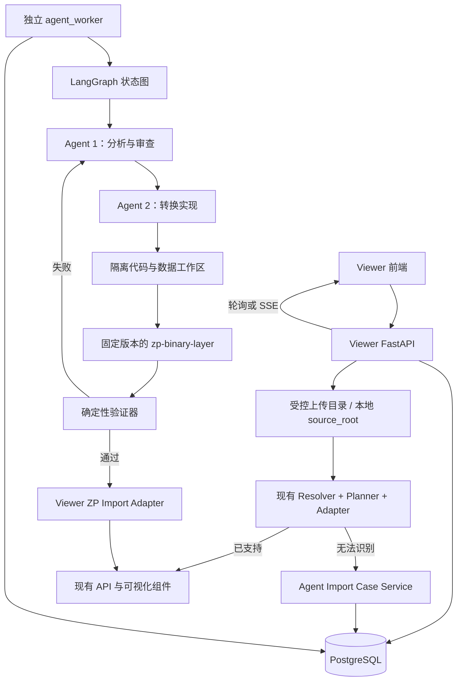
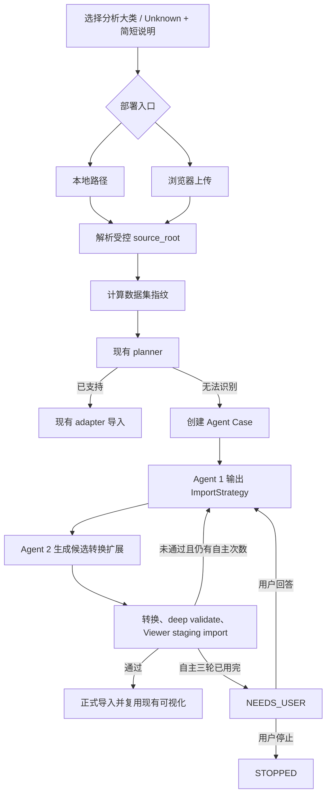

# 陌生谱图 Agent 总体设计

> 文档状态：方案设计稿  
> 适用项目：`E:\viewer`（Viewer）与 `E:\viewer-two`（`.zp` 二进制中间层）  
> 本文描述目标架构，不表示相关功能已经实现。

## 1. 目标

当 Viewer 无法识别用户提交的谱图或结果包时，系统自动进入受控的 Agent 导入流程：

1. 先让用户选择分析大类或补充简短描述，减少模型探索范围和 token 消耗。
2. 优先运行 Viewer 已有的确定性 planner 和 adapter。
3. 只有现有导入链路无法识别时，才创建陌生谱图 Agent Case。
4. Agent 1 分析文件结构并生成结构化导入策略。
5. Agent 2 在隔离环境中扩展 `.zp` 转换能力并生成测试。
6. 确定性验证器检查 `.zp`、Viewer 临时导入和可视化数据契约。
7. 首次允许最多三轮自主修复；三轮失败后请求用户补充信息。
8. 此后每次用户回答只允许再尝试一轮；失败后必须再次询问。
9. 成功后复用 Viewer 现有 API、谱图组件和业务页面。
10. 用户可以随时停止任务。

## 2. 非目标

第一阶段不包含：

- 绕过现有 planner，让所有导入都调用大模型。
- 让 Agent 直接修改运行中的 Viewer 或 `E:\viewer-two` 工作目录。
- 让 Agent 自行改变冻结的 `.zp` 核心格式或默认版本。
- 在浏览器中直接解析 `.zp`、PFMB、mzML 或其他大文件。
- 在没有登录系统时伪造用户级任务隔离和私有未读状态。
- 自动合并生成代码到正式分支。
- 把 LangGraph 当成数据转换器、导入 adapter 或业务数据库。

## 3. 当前能力基线

### 3.1 Viewer 已有能力

| 能力 | 当前实现 |
| --- | --- |
| 大类选择 | Top-Down、Bottom-Up、DDA，以及对应的细分导入格式 |
| 本地导入 | 服务器本机路径导入 |
| 服务器导入 | 浏览器选择本地文件并上传到 Viewer 管理目录 |
| 格式识别 | root resolver、planner、detector |
| 已知格式 | TopPIC HTML、PrSM bundle、TopPIC native、DIA-NN、DIA-CLIP、mzML、Thermo RAW |
| RAW 转换 | Thermo RAW 经 ThermoRawFileParser 转为 mzML |
| 入库 | 独立 ingest adapter 写入 universal schema |
| 派生数据 | mzML scan index、chromatogram summary、PFMB sidecar |
| 可视化 | TD/BU 谱图、XIC、chromatogram、PFMB、sequence coverage、LCMS 3D |
| 任务状态 | `import_jobs` 表与前端轮询 |

当前浏览器只在 `localStorage` 中保存活动上传任务引用，不能承担跨电脑 Agent 上下文管理。当前导入后台执行主要依赖进程内线程，不适合作为可恢复的 Agent 工作流执行器。

### 3.2 `.zp` 二进制层已有能力

`E:\viewer-two` 已形成独立的 `.zp` 转换层：

```text
SourceInspector
→ SourceProfile
→ PlanBuilder
→ PipelineRunner
→ StepRegistry 中的固定 Named Steps
→ Typed Blocks
→ 唯一 ZpWriter
→ ZpReader / ZpValidator
```

公开转换入口是：

```python
convert_source_to_zp(source_path, target_path, format_version=..., options=...)
```

该项目当前仍明确声明 Viewer 集成尚未完成。同时，工作目录中存在尚未提交的 v3 开发内容，因此正式 Agent 流程必须绑定一个已确认的干净 commit，不能直接使用或修改开发者正在工作的目录。

## 4. 已确认的架构决策

| 主题 | 决策 |
| --- | --- |
| Agent 框架 | 使用 LangGraph 作为持久化工作流编排器 |
| 部署方式 | Viewer API 与独立 `agent_worker` 分离 |
| 状态持久化 | PostgreSQL Checkpointer + Viewer 业务表 |
| 本地模式 | 本地部署继续使用路径导入 |
| 服务器模式 | 服务器部署使用浏览器上传 |
| 汇合点 | 两种入口统一得到受控 `source_root` 后进入同一流程 |
| 二进制目标 | 优先转换为经过验证的 `.zp`，不另造通用格式 |
| Agent 代码执行 | 只允许在隔离工作区执行 |
| 正式代码接纳 | 人工批准后才能进入公共 adapter |
| 用户身份 | 第一阶段按单工作区处理，鉴权留作后续领导确认 |
| 通知计数 | 只统计需要用户回答或确认的任务 |

## 5. 总体架构



### 5.1 为什么增加确定性编排器

Agent 1 可以负责监督和解释，但不能负责：

- 可靠记录当前轮次。
- 保证三轮规则。
- 在服务重启后恢复。
- 防止两个 Worker 同时处理同一 Case。
- 决定用户输入应恢复哪个 Case。
- 原子更新任务状态和通知。

这些职责由 LangGraph 状态图、PostgreSQL checkpoint 和 Viewer 业务表共同承担。

### 5.2 LangGraph 的边界

LangGraph只负责：

- 节点顺序和条件分支。
- 保存 Agent 状态。
- 中断并等待用户输入。
- 从 checkpoint 恢复。
- 记录 Agent 1、Agent 2和验证节点的输出。

LangGraph不负责：

- 上传大文件。
- 递归扫描和指纹算法。
- 写 universal schema。
- 写 `.zp`。
- 判断 `.zp` 是否科学有效。
- 直接执行未受控系统命令。

## 6. 统一导入流程



### 6.1 大类选择

保留当前 Top-Down、Bottom-Up、DDA 选择，并新增：

- `Unknown / Other`
- 一行简短说明，例如“厂商结果包”“只有谱图无鉴定”“可能是 DIA”

大类选择只用于约束探索范围，不代替文件证据。Agent 1 必须根据实际文件输出证据，不能因为用户选了 Bottom-Up 就强行解释为 Bottom-Up。

### 6.2 现有 planner 优先

进入 Agent 前必须先完成：

1. `resolve_ingest_root`
2. metadata fingerprint
3. `plan_zip_ingest`
4. 用户选择与物理布局校验

只有未支持的布局或确认需要新增转换能力时才创建 Agent Case。缺少必需文件、同名冲突、重复数据集等普通错误仍由现有导入流程直接返回，不浪费 Agent 调用。

## 7. Agent 职责

### 7.1 Agent 1：分析与审查

允许：

- 读取受控数据目录中的文件清单、有限头部和抽样内容。
- 读取 Viewer 与 `.zp` 的公开文档、schema 和接口。
- 识别文件角色、运行数、谱图来源和结果类型。
- 输出严格的 `ImportStrategy`。
- 审查 Agent 2 的代码差异、测试和错误日志。
- 在无法确定语义时生成最小化用户问题。

禁止：

- 修改代码。
- 写 `.zp`。
- 写正式数据库。
- 自行放宽 validator。
- 读取受控目录外的用户文件、密钥或 `.env`。

### 7.2 Agent 2：转换实现

允许：

- 在临时 worktree 中生成最小代码差异。
- 新增 source inspector、schema、adapter、BlockTool、plan、registry 和测试。
- 运行允许名单中的测试与转换命令。
- 生成候选 `.zp` 和验证报告。

禁止：

- 修改运行中的 `E:\viewer` 或 `E:\viewer-two`。
- 直接向正式分支提交、推送或部署。
- 新建第二个 `.zp` writer。
- 在 `PipelineRunner` 或 `StepRegistry` 中加入质谱业务分支。
- 为了通过测试放宽 validator。
- 在未经格式评审时修改核心 block 或冻结物理格式。

### 7.3 确定性验证节点

验证节点不是 Agent。它执行固定检查：

1. 候选差异范围检查。
2. `.zp` 二进制层测试。
3. 输入副本转换。
4. `validate_zp(mode="deep")`。
5. 输入身份前后对比。
6. 目标文件原子提交检查。
7. Viewer 临时数据集入库。
8. Viewer 关键 API DTO 检查。
9. 至少一个适用可视化页面的数据可用性检查。

最终是否通过由这些门禁决定，而不是由 Agent 1 的自然语言结论决定。

## 8. `.zp` 与 Viewer 的接入边界

需要在 Viewer 新增两个独立模块，但本设计阶段不实现：

### 8.1 `ZpImportAdapter`

职责：

- 只通过 `.zp` 的公开 Reader API 读取逻辑对象。
- 将 run、spectrum、identification 和业务 Extension 映射到 universal schema。
- 在 dataset/run metadata 中保存 `.zp` 文件路径、版本、SHA-256 和验证证书。
- 支持临时 staging dataset 和正式 dataset 两种目标。

禁止：

- 解析 `.zp` 私有字节布局。
- 调用 Writer。
- 修改 `.zp` 内容。
- 把业务映射塞进 API route。

### 8.2 `ZpSpectrumReaderService`

职责：

- 按 run/scan/spectrum ID 从 `ZpReader` 读取目标数组。
- 返回 Viewer 现有谱图 DTO。
- 对 v2/v3 等物理版本保持透明。
- 让前端继续复用现有谱图、XIC 和 chromatogram 组件。

## 9. 通知与交互

### 9.1 左上角信息按钮

- 固定在顶栏下方左侧，不覆盖 Viewer logo 和导航。
- 红色圆形数字只显示 `NEEDS_USER` 数量。
- `1` 表示一个待回答任务，`2` 表示两个，以此类推。
- 数量为零时隐藏红色角标。

### 9.2 通知抽屉

每条通知显示：

- 数据集名称。
- 分析大类。
- 当前状态。
- 最后失败节点。
- 简短问题。
- 等待时长。
- “查看并回答”入口。

### 9.3 Agent Case 页面

页面包含：

- Case 状态、模式、数据指纹和任务编号。
- Agent 1 / Agent 2 / 系统验证三类消息。
- 三轮自主尝试时间线。
- 当前需要用户回答的问题。
- 用户回复输入框。
- 转换策略、测试报告和产物摘要。
- 手动停止按钮。

## 10. 第一阶段部署方案

```text
viewer-api
  ├─ 现有导入 API
  ├─ Agent Case / message / notification API
  └─ 上传与路径入口

agent-worker
  ├─ LangGraph
  ├─ PostgreSQL checkpointer
  ├─ Agent 1
  ├─ Agent 2
  └─ Sandbox executor

postgres
  ├─ 现有 Viewer schema
  ├─ agent_import_cases
  ├─ agent_attempts
  ├─ agent_messages
  ├─ agent_artifacts
  └─ agent_notifications

data-root
  ├─ 原始上传或本地受控数据
  ├─ .viewer-derived
  └─ .viewer-agent/
      ├─ cases/
      ├─ candidates/
      └─ artifacts/
```

第一阶段不要求 Redis。Worker 使用数据库租约领取待执行 Case，避免 FastAPI 后台线程承担长任务。若以后需要多 Worker、大规模流式事件和集中部署，再评估 LangGraph Agent Server 或其他任务队列。

## 11. 分阶段实施计划

### P0：文档、契约和静态原型

- 固化本文架构。
- 固化状态机和 JSON 契约。
- 固化 `.zp` 接入边界。
- 完成交互 HTML Demo。

退出条件：产品、导入和二进制层负责人对边界达成一致。

### P1：Case 与上下文基础设施

- 新增 Agent 业务表。
- 新增 Case/message/notification API。
- 新增数据库租约。
- 接入 LangGraph PostgreSQL checkpointer。
- 不调用真实代码生成 Agent。

退出条件：服务重启和两台电脑同时打开时，Case 状态与消息不混淆。

### P2：只读分析 Agent

- 新增受控文件清单和抽样工具。
- Agent 1 输出 `ImportStrategy`。
- 现有 planner 失败后可创建 Case。
- 不生成代码、不执行转换。

退出条件：对已知测试包生成稳定策略，对不确定语义能提出具体问题。

### P3：隔离转换 Agent

- 固定 `viewer-two` 基础 commit。
- 建立临时 worktree 和命令允许名单。
- Agent 2 生成候选扩展与测试。
- 实现三轮自主策略和后续单轮用户驱动策略。

退出条件：所有写入限制在 Case sandbox；无法触及正式代码与源数据。

### P4：Viewer `.zp` 接入

- 实现 `ZpImportAdapter`。
- 实现 `ZpSpectrumReaderService`。
- 完成 staging import。
- 复用现有谱图页面。

退出条件：候选 `.zp` 经 deep validation 后可创建临时 Viewer dataset 并展示至少一种谱图视图。

### P5：人工接纳与公共复用

- 展示代码差异和验证证据。
- 人工批准后进入正式 adapter。
- 已接纳格式进入现有确定性 planner。
- 相同格式后续不再调用 Agent。

退出条件：公共 adapter 有固定测试、版本和回滚方式。

### 后续：用户与组织隔离

需要领导确认：

- 登录方式。
- 用户、组织和项目模型。
- Agent Case 所有权。
- 用户级通知已读状态。
- 管理员查看和审计权限。
- 模型费用与配额归属。

## 12. 主要风险与控制

| 风险 | 控制 |
| --- | --- |
| Agent 修改生产代码 | 只写临时 worktree；正式接纳需人工批准 |
| 误解释科学语义 | 严格 admission、schema、validator 和用户问题 |
| token 过高 | 大类预选、现有 planner 优先、清单与抽样、结构化上下文 |
| 多电脑串话 | 服务端 `case_id`、消息序号、上下文版本和执行租约 |
| 无登录导致越权 | 第一阶段声明为单工作区；不声称用户级隔离 |
| 三轮无限循环 | 状态机硬编码轮次规则 |
| `.zp` 格式被偷偷改变 | `FORMAT_REVIEW_REQUIRED` 门禁 |
| 破坏 `viewer-two` 开发工作 | 固定 clean commit，使用临时 worktree |
| 验证器被 Agent 放宽 | validator 变更自动进入人工格式评审 |
| 源文件被覆盖 | 源只读、目标 no-overwrite、临时文件原子提交 |

## 13. 完成标准

完整功能最终需要同时满足：

1. 已知格式不触发 Agent。
2. 本地路径和服务器上传进入同一内部流程。
3. 每个陌生数据集创建唯一 Case。
4. 两台电脑打开不同 Case 时消息不混淆。
5. 首次严格限制三轮自主尝试。
6. 三轮失败后产生一个需要用户回答的通知。
7. 用户每次回答后只运行一轮。
8. 用户可停止任务。
9. Agent 2 无法修改正式工作目录和正式数据库。
10. 候选 `.zp` 必须 deep validation 通过。
11. Viewer staging import 和关键 API 检测通过。
12. 前端能够复用至少一个现有可视化组件。
13. 公共 adapter 必须经过人工接纳。

## 14. 相关文档

- [Agent状态机与上下文设计.md](Agent状态机与上下文设计.md)
- [ZP转换接入与安全边界.md](ZP转换接入与安全边界.md)
- [陌生谱图Agent交互原型.html](陌生谱图Agent交互原型.html)
- `docs/developer/数据导入模块.md`
- `docs/developer/导入中间层.md`
- `docs/developer/二进制与侧车格式.md`
- `docs/developer/可视化模块.md`
- `E:\viewer-two\README.md`
- `E:\viewer-two\AGENTS.md`

## 15. 外部框架参考

- LangGraph Overview：<https://docs.langchain.com/oss/python/langgraph/overview>
- LangGraph Persistence：<https://docs.langchain.com/oss/python/langgraph/persistence>
- LangGraph Interrupts：<https://docs.langchain.com/oss/python/langgraph/interrupts>
- Checkpointer Integrations：<https://docs.langchain.com/oss/python/integrations/checkpointers/index>
