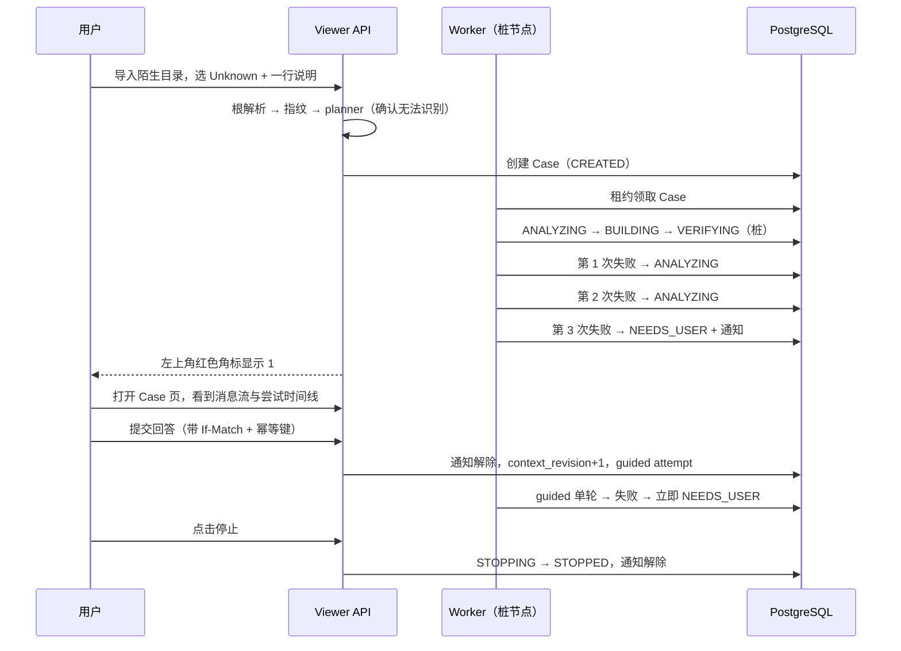
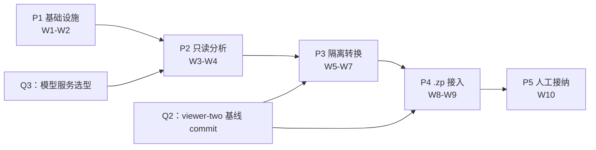

# Viewer 项目开发计划

> 文档版本：v1.0　　编写日期：2026-07-29　　文档性质：**内部工程文档**
> 计划范围：**陌生谱图 Agent 功能**（PRD §6.6 / SRS §4.11）
> 上游文档：[产品需求文档PRD.md](产品需求文档PRD.md)、[需求规格说明书SRS.md](需求规格说明书SRS.md)

---

## 1. 计划基线

### 1.1 资源与节奏

| 项 | 值 |
| --- | --- |
| 开发人力 | **1 人** |
| 迭代长度 | 1 周（按相对周次 W1、W2… 排期，不绑定日历日期） |
| 本周（W1）目标 | **产出一个可演示的 demo** |
| 后续 | 继续完善，直至满足 PRD §9.2 的 13 条完整验收标准 |

### 1.2 范围声明

本计划**只排 Agent 功能**。以下已在 PRD 中记录的其他待办**不在本计划内**，需要时另行立项：BU 的 Bruker `.d` match 级证据（M8）、双模式导入的断点续传与过期清理、生产化部署、API 错误码统一、Top-Down 路由测试补齐、前端重复目录清理。

### 1.3 起点盘点

Agent 功能的六个阶段中，P0 实质已完成：

| 阶段 | 内容 | 状态 |
| --- | --- | --- |
| **P0** | 架构设计、状态机与契约、`.zp` 接入边界、交互原型 | **已完成**——三份设计文档 + `陌生谱图Agent交互原型.html` 已在 `docs/agent/` 下；本次补齐 PRD/SRS/计划三份顶层文档 |
| P1 | Case 与上下文基础设施 | 未开始 |
| P2 | 只读分析 Agent | 未开始 |
| P3 | 隔离转换 Agent | 未开始，**被 Q2 阻塞** |
| P4 | Viewer `.zp` 接入 | 未开始，依赖 P3 |
| P5 | 人工接纳与公共复用 | 未开始，依赖 P4 |

P0 的退出条件是「产品、导入和二进制层负责人对边界达成一致」——**这一条尚未确认**，见 §7 的 Q2。

---

## 2. 工作量估算

按 SRS 的需求条目自下而上估算。单位为人天（1 人天 = 1 个专注工作日）。

| # | 工作包 | 对应需求 | 估算 |
| --- | --- | --- | --- |
| T1 | 5 张 Agent 业务表 + 迁移 SQL + 约束与索引 | SRS §3.2 | 0.5 |
| T2 | Case service：状态机、轮次规则、状态流转守卫 | FR-AGT-13~20 | 1.5 |
| T3 | 乐观并发（`If-Match`）+ 幂等键 + 消息序号 | FR-AGT-28~29、FR-AGT-32 | 1.0 |
| T4 | Case / message / notification REST API（11 个端点） | FR-AGT-01~12 | 1.5 |
| T5 | Worker 骨架：数据库租约领取、续租、崩溃恢复 | FR-AGT-30~31、FR-AGT-33 | 1.5 |
| T6 | LangGraph `StateGraph` 接入 + PostgreSQL Checkpointer | FR-AGT-21~27 | 2.0 |
| T7 | planner 兜底：无法识别时创建 Case | FR-AGT-01、PR-AGT-03~04 | 0.5 |
| T8 | 前端：`Unknown / Other` 导入类型 + 说明输入 | UI-40 | 0.5 |
| T9 | 前端：信息按钮 + 红色角标 + 通知抽屉 | UI-38~39 | 1.0 |
| T10 | 前端：Case 页（消息流、时间线、回复框、停止按钮、证据面板） | UI-20、PR-AGT-08 | 2.0 |
| T11 | 受控抽样工具（6 个窄接口）+ 路径与符号链接防护 | FR-AGT-37~38 | 1.5 |
| T12 | 上下文装配：分层、每轮注入、结构化摘要 | FR-AGT-34~36 | 1.5 |
| T13 | Agent 1：真实模型调用 + `ImportStrategy` 契约与拒绝条件 | FR-AGT-39~41 | 2.5 |
| T14 | 沙箱：Case 目录、权限、临时 worktree、命令白名单 | FR-AGT-48~51 | 2.5 |
| T15 | Agent 2：候选实现生成 + `CandidateImplementation` 契约 | FR-AGT-42 | 2.5 |
| T16 | 确定性差异检查（8 项） | FR-AGT-43 | 1.5 |
| T17 | 验证器编排（9 项固定门禁）+ 证书生成 | FR-AGT-44~47 | 2.5 |
| T18 | `ZpImportAdapter`（含 TD/BU/仅谱图三套独立映射） | FR-AGT-62~64 | 3.0 |
| T19 | `ZpSpectrumReaderService` | FR-AGT-65 | 2.0 |
| T20 | 暂存数据集机制（不出现在正常列表、失败清理） | FR-AGT-29、NFR-REL-06 | 1.5 |
| T21 | 错误分类与四类路由 | FR-AGT-52~53 | 1.0 |
| T22 | 停止语义（8 步）+ 外部进程终止 | FR-AGT-59~60 | 1.0 |
| T23 | 故障恢复矩阵实现与验证 | FR-AGT-61 | 1.0 |
| T24 | 人工接纳流程（差异展示、证据归档、干净分支重放） | FR-AGT-31、PR-AGT-31 | 1.5 |
| T25 | 测试：状态机、并发幂等、上下文、安全四类 | SRS §9.4 | 3.0 |
| | **合计** | | **约 42 人天** |

**结论：约 42 人天 ≈ 8.5 个工作周**（未含需求变更、调试超预期、模型调优反复）。加 20% 缓冲，**现实周期为 10 周左右**。

这个数字与「1 人一周」的差距必须摆在明面上：**一周不可能交付完整功能**，一周只能交付一个**范围明确削减过的可演示原型**。下面 §4 定义这个原型的确切边界。

---

## 3. 里程碑总览

```mermaid
gantt
    dateFormat X
    axisFormat W%d
    section 本周
    W1 Demo：Case 闭环骨架          :done, w1, 0, 1
    section 基础设施
    W2 P1 收口：编排器与并发         :w2, 1, 1
    section 只读分析
    W3-W4 P2：抽样、上下文、Agent 1  :w3, 2, 2
    section 隔离转换
    W5-W6 P3：沙箱与 Agent 2        :w5, 4, 2
    W7 验证器编排                    :w7, 6, 1
    section Viewer 接入
    W8-W9 P4：.zp 适配与暂存导入     :w8, 7, 2
    section 接纳
    W10 P5：人工接纳与全量验收       :w10, 9, 1
```

| 里程碑 | 周次 | 交付物 | 退出条件 |
| --- | --- | --- | --- |
| **M-Demo** | W1 | Case 闭环骨架，可演示 | 见 §4.3 |
| **M-P1** | W2 | Case 与上下文基础设施完成 | 服务重启与两台电脑同时打开时，Case 状态与消息不混淆 |
| **M-P2** | W3–W4 | 只读分析 Agent | 对已知测试包生成稳定策略；对不确定语义能提出具体问题 |
| **M-P3** | W5–W7 | 隔离转换 Agent + 验证器 | 所有写入限制在 Case 沙箱；无法触及正式代码与源数据 |
| **M-P4** | W8–W9 | Viewer `.zp` 接入 | 候选 `.zp` 深度验证后可创建临时数据集并展示至少一种谱图视图 |
| **M-P5** | W10 | 人工接纳与公共复用 | 公共 adapter 有固定测试、版本与回滚方式 |

---

## 4. W1：Demo 冲刺（本周）

### 4.1 Demo 要讲的故事

演示的目标不是展示 AI 有多聪明，而是展示**这套受控流程是可信的**——轮次不会失控、状态不会丢、用户始终有控制权。因此 Demo 讲这条链路：

演示时要**当场展示三个反直觉的正确行为**，这是这套设计的价值所在：

1. 重复提交同一个回答（刷两次），只产生**一条**消息；
2. 用旧版本页面提交回答，得到 **409** 并提示刷新；
3. 演示中途重启 API 进程，Case 状态与消息**完好无损**。

### 4.2 范围切割

| 纳入 W1 | 排除（移至 W2+） |
| --- | --- |
| T1 建表与迁移 | T11 受控抽样工具 |
| T2 状态机与轮次规则（完整实现，不打折） | T12 上下文装配 |
| T3 乐观并发 + 幂等 + 消息序号 | T13 Agent 1 真实模型调用 |
| T4 的 **6 个核心端点**：创建 / 列表 / 摘要 / 取消息 / 提交回答 / 停止 | T4 的 attempts、artifacts、SSE 三个端点 |
| T5 Worker 租约领取与续租 | T14–T17 沙箱、Agent 2、验证器 |
| T7 planner 兜底创建 Case | T18–T20 `.zp` 接入 |
| T8 `Unknown / Other` 导入类型 | T24 人工接纳流程 |
| T9 信息按钮 + 角标 + 通知抽屉 | — |
| T10 的 **简化版** Case 页：消息流 + 尝试时间线 + 回复框 + 停止按钮（证据面板留占位） | T10 的完整证据面板 |
| T25 的 **状态机与并发两类**测试 | T25 的上下文与安全两类测试 |
| **桩验证节点**：按预设脚本返回失败/成功，不调用模型、不碰 `.zp` | 真实 Agent 与真实转换 |

**关键取舍：状态机与并发控制不打折。** 这两块是整个功能的骨架，如果为了赶 Demo 做成简化版，后面每一周都要在错误的基础上叠加。桩掉的是「智能」部分（模型调用、代码生成、`.zp` 转换），保留的是「受控」部分——而受控恰好是这次 Demo 要证明的东西。

### 4.3 Demo 验收标准

Demo 通过的判据（对应 PRD §9.2 的 13 条中的 8 条）：

| # | 标准 | 对应完整验收 |
| --- | --- | --- |
| D1 | 已知格式导入**不**创建 Case | 第 1 条 |
| D2 | 陌生目录导入创建唯一 Case，且指纹与来源模式正确记录 | 第 3 条 |
| D3 | 第 1、2 次桩失败自动继续；第 3 次**必定**进入 `NEEDS_USER` | 第 5 条 |
| D4 | 进入 `NEEDS_USER` 时产生一条通知，左上角角标显示 1；为零时角标隐藏 | 第 6 条 |
| D5 | 用户回答后只运行 1 轮；该轮失败立即回到 `NEEDS_USER`；自主配额**不恢复** | 第 7 条 |
| D6 | 用户可停止；停止后保留消息与记录，通知解除，源文件未被删除 | 第 8 条 |
| D7 | 重复幂等键只产生一条消息；陈旧版本提交返回 409；`sequence_no` 严格递增 | 第 4 条 |
| D8 | API 重启后 Case 状态、消息、通知一致 | 第 4 条 |
| D9 | 界面显示「共享工作区」，无任何用户名 | PR-AGT-11 |

**明确不在 Demo 验收范围**：第 9–13 条（沙箱隔离、深度验证、暂存导入、可视化复用、人工接纳）全部依赖后续阶段。演示时须**主动说明**这一点，不能让观众误以为功能已完整。

### 4.4 逐日安排

| 日 | 任务 | 当日可验证的结果 |
| --- | --- | --- |
| **D1** | T1 建表与迁移；T2 状态机骨架（状态枚举、合法流转表、轮次伪代码落地） | 状态机单元测试：3 次自主失败路由正确 |
| **D2** | T2 收尾；T3 乐观并发、幂等键、消息序号 | 并发测试：重复幂等键只写一条、陈旧版本 409 |
| **D3** | T4 六个核心端点；T7 planner 兜底 | 用 HTTP 客户端跑通「创建 → 查询 → 回答 → 停止」 |
| **D4** | T5 Worker 租约 + 桩验证节点脚本 | 后台推进可见：Case 自动走完 3 轮进入 `NEEDS_USER` |
| **D5** | T8 + T9 + T10 简化版前端 | 浏览器中完成 §4.1 的完整链路演示 |
| **缓冲** | 若前端超期，先保证角标与 Case 页可用，尝试时间线可延后 | — |

**5 天排了约 6 人天的量**，前端（T8+T9+T10 简化版 ≈ 2.5 人天）压在最后一天是主要风险。缓解办法见 §6 的 R1：D5 优先做角标与消息流，时间线与证据面板占位。

### 4.5 W1 的技术决策点

有一个决策会显著影响 W1 的可行性，我给出建议但需要你确认：

**D-W1-1：W1 是否直接引入 LangGraph？**

| 方案 | 优点 | 代价 |
| --- | --- | --- |
| **A（推荐）不引入，W1 用普通后台线程 + 数据库状态推进** | Demo 风险最低；状态机与并发逻辑本身**与编排器无关**，不会返工 | W2 接 LangGraph 时需要把线程推进器替换为图节点，约 0.5 人天的适配 |
| B 直接引入 LangGraph + PostgreSQL Checkpointer | 不需要替换 | 学习曲线与 checkpointer 配置约 2 人天，会直接吃掉 Demo 的全部余量 |

推荐 A 的理由：SRS 已经明确要求「checkpoint 用于恢复执行，业务表用于查询、审计与 UI」两者职责分离（FR-AGT-27）。既然业务表是状态真源，那么 W1 用什么推进业务表状态就不影响后续——**这层分离本身就是为了让编排器可替换**。

---

## 5. 后续迭代

### 5.1 W2 — P1 收口

| 任务 | 说明 |
| --- | --- |
| T6 | 引入 LangGraph `StateGraph` 与 PostgreSQL Checkpointer，把 W1 的线程推进器替换为图节点；节点仍为桩 |
| T4 补齐 | attempts、artifacts 两个端点（SSE 延后到 P2 之后按需） |
| T10 补齐 | Case 页证据面板 |
| T22 | 停止语义完整实现（安全点检查、外部进程句柄预留） |
| T23 | 故障恢复矩阵：Worker 崩溃后从检查点恢复，且不重复副作用 |
| T25 补 | 并发与恢复测试补全 |

**退出条件**：服务重启和两台电脑同时打开时，Case 状态与消息不混淆（设计文档 P1 退出条件）。

### 5.2 W3–W4 — P2 只读分析 Agent

| 任务 | 说明 |
| --- | --- |
| T11 | 6 个受控抽样窄接口 + 路径/符号链接/pickle 防护 |
| T12 | 上下文分层装配、每轮注入规则、结构化摘要生成 |
| T13 | Agent 1 真实模型调用、`ImportStrategy` JSON 契约、8 条策略拒绝条件 |
| T21 | 错误分类四类路由（此时可先落地「用户可补充」与「基础设施」两类） |
| T25 补 | 上下文类测试 |

**退出条件**：对已知测试包生成稳定策略；对不确定语义能提出具体问题。**此阶段仍不生成代码、不执行转换**。

**前置阻塞**：Q3（模型服务选型与配额）必须在 W3 开始前解决。

### 5.3 W5–W7 — P3 隔离转换 Agent

| 周 | 任务 |
| --- | --- |
| W5 | T14 沙箱：Case 目录结构、权限矩阵、固定 commit 的临时 worktree、命令白名单 |
| W6 | T15 Agent 2 候选实现生成 + `CandidateImplementation` 契约；T16 确定性差异检查 8 项 |
| W7 | T17 验证器编排 9 项门禁 + 深度验证证书；T21 补齐人工评审类错误路由 |

**退出条件**：所有写入限制在 Case 沙箱内；无法触及正式代码与源数据。

**前置阻塞**：Q2（`viewer-two` 的干净基线 commit 与批准的格式版本）必须在 W5 开始前解决。**这是整个计划最硬的依赖**——没有基线 commit，沙箱无从建立。

### 5.4 W8–W9 — P4 Viewer `.zp` 接入

| 周 | 任务 |
| --- | --- |
| W8 | T18 `ZpImportAdapter` + TD/BU/仅谱图三套独立映射 |
| W9 | T19 `ZpSpectrumReaderService`；T20 暂存数据集机制 |

**退出条件**：候选 `.zp` 经深度验证后可创建临时 Viewer 数据集并展示至少一种谱图视图，且**复用现有组件**而非新造图表。

### 5.5 W10 — P5 人工接纳

| 任务 | 说明 |
| --- | --- |
| T24 | 差异与证据展示、人工批准入口、干净分支重放流程、新 source type 接入确定性 planner |
| T25 补 | 安全类测试补全 |
| 验收 | PRD §9.2 的 13 条全量验收 + §9.1 现有功能回归 |

**退出条件**：公共 adapter 有固定测试、版本与回滚方式；相同格式后续不再触发 Agent。

### 5.6 计划外（需另行立项）

用户与组织隔离（登录、RBAC、用户级已读、费用归属）。设计文档明确此项「需要领导确认」，且可在不改变 Case 核心状态机的前提下增加——因此**不应挤进本计划**，否则会阻塞主线。

---

## 6. 关键路径与风险

### 6.1 依赖关系

关键路径为 `P1 → P2 → P3 → P4 → P5`，全程串行，**单人开发无并行压缩空间**。两个外部决策 Q2、Q3 分别悬在 P3 与 P2 头上。

### 6.2 风险登记

| # | 风险 | 影响 | 概率 | 应对 |
| --- | --- | --- | --- | --- |
| **R1** | W1 前端工作量压在最后一天，Demo 交付不全 | Demo 缺角标或 Case 页 | 高 | D5 按「角标 → 消息流 → 回复框 → 停止 → 时间线」优先级递减实现，时间线可占位；D3/D4 若提前完成则前移前端 |
| **R2** | Q2 未按时解决，P3 无法开始 | W5 起停摆，整体延期 | **中高** | 本周内即向二进制层负责人提出基线 commit 需求；若 W4 末仍未定，先做 P4 中不依赖 Agent 的部分（`ZpSpectrumReaderService` 可用手工生成的 `.zp` 开发） |
| **R3** | Q3 未解决或模型成本超预算 | W3 起停摆 | 中 | 本周内确认模型服务与配额；设计上保持 provider 可替换 |
| **R4** | 模型无法在 3 轮内解决实际陌生格式 | 功能价值不达预期 | 中 | P2 阶段先用**已知格式**做回归验证（把已支持格式当作「陌生」输入，检验策略是否与既有 adapter 结论一致），再上真实陌生数据 |
| **R5** | Agent 生成代码越界 | 破坏生产代码或数据 | 低（有设计防护） | 差异检查与沙箱在 Agent 2 落地**之前**先完成并测试（W5 在 W6 之前，顺序不可颠倒） |
| **R6** | `.zp` 格式被隐式改动 | 破坏二进制层兼容性 | 低 | `FORMAT_REVIEW_REQUIRED` 门禁；验证器变更自动转人工评审 |
| **R7** | 单人开发，中断即停摆 | 全线延期 | 中 | 每周产出可运行的中间态；设计文档已固化，交接成本可控 |
| **R8** | 42 人天估算偏乐观（尤其 T13/T15 的模型调优反复） | 延期 2–3 周 | 中高 | 已按 10 周（含 20% 缓冲）对外沟通；每周迭代末复估剩余量 |
| **R9** | 与主干代码冲突（导入链路同时被其他改动触碰） | 返工 | 低 | Agent 代码尽量隔离在新模块（`back/app/agent_*`、`back/app/ingest/zp/`、`back/app/spectrum_zp/`），只在 planner 兜底处留一个窄接入点 |

### 6.3 R4 的做法值得单独说明

「用已知格式当陌生格式来测」是本计划中成本最低、信息量最高的验证手段：TopPIC HTML 树、DIA-NN 目录这些格式我们**已经有确定性 adapter 作为标准答案**。让 Agent 1 在不知道答案的前提下分析它们，然后把输出的 `ImportStrategy` 与既有 adapter 的实际行为逐字段比对——单位、run 关联方式、角色基数、鉴定层级是否一致。这能在不花任何真实陌生数据的情况下，量化出 Agent 1 的可靠性基线。

---

## 7. 待决策事项

以下事项**阻塞计划执行**，需要在标注的时间点前得到答复。

| # | 事项 | 需谁决策 | 最晚需要时间 | 阻塞 |
| --- | --- | --- | --- | --- |
| **Q2** | `viewer-two` 的干净基线 commit SHA、批准的 `.zp` 格式版本、只读仓库或镜像地址 | 二进制层负责人 | **W4 末** | P3、P4（W5 起全部工作） |
| **Q3** | 模型服务商、配额与单 Case 成本上限 | 上级 | **W2 末** | P2（W3 起全部工作） |
| **Q1** | 登录与鉴权方案 | 上级 | 无硬期限 | 计划外，但影响最终能否多用户部署 |
| **D-W1-1** | W1 是否直接引入 LangGraph（见 §4.5，建议方案 A） | 本人/评审 | **W1 开始前** | W1 排期 |
| Q-P0 | P0 退出条件「三方对边界达成一致」是否已达成 | 产品 + 导入 + 二进制层负责人 | **W1 内** | 后续全部阶段的合法性 |

---

## 8. 质量门禁

### 8.1 每次提交

| 门禁 | 要求 |
| --- | --- |
| 后端 lint | Ruff 通过（行宽 120、py312） |
| 后端测试 | `pytest` 全绿；新增需求须有对应测试 |
| 前端 lint | `pnpm lint` 通过 |
| 前端构建 | `tsc -b && vite build` 通过 |
| 回归约束 | `git diff front/src/features/prsm` 保持为空 |
| 模块边界 | 新代码不得违反 `AGENTS.md`：编排层不得内联指纹/扫盘算法；不得写死本机盘符 |

### 8.2 每个里程碑

| 门禁 | 要求 |
| --- | --- |
| 现有功能回归 | PRD §9.1 的 6 条全部通过 |
| 前端 E2E | Playwright 19 个既有规格全绿 |
| 性能基线 | `cs/指纹性能测验.py` ≤ 0.5 秒 |
| 阶段退出条件 | 达成 §3 表中该里程碑的退出条件 |
| 文档同步 | SRS 中相关需求的状态标记从 [规划中] 改为 [已实现]，并补追溯矩阵条目 |

### 8.3 Agent 专属门禁

从 P3 起，每次涉及沙箱或 Agent 2 的改动须额外通过 SRS §9.4 的安全类测试：修改禁止路径在执行前失败、修改验证器进入人工评审、符号链接逃逸失败、任意 shell 参数失败、Agent 无法连接正式库、无法覆盖已有目标、无法读取 `.env`。

**这七条测试必须在 Agent 2 具备真实代码生成能力之前就已通过。** 顺序颠倒的后果是：一个还没有护栏的代码生成器已经能跑了。

---

## 9. 沟通与文档维护

| 项 | 约定 |
| --- | --- |
| 迭代节奏 | 每周末复估剩余工作量，更新本文 §2 与 §3 |
| 状态同步 | 需求实现后立即更新 SRS 的状态标记，不积压 |
| 决策留痕 | 新增的锁定决策追加到本文 §7，或另建决策登记表（可参照 `budocs/决策登记表.md` 的形式） |
| 验收脚本 | 性能与验收脚本置于 `cs/`，优先中文文件名，通过调用模块公开 API 实现（`AGENTS.md` §4） |
| 设计变更 | 若实现过程中发现设计文档有误，先改设计文档再改代码，不允许代码与设计静默分叉 |

---

## 10. 相关文档

| 文档 | 用途 |
| --- | --- |
| [产品需求文档PRD.md](产品需求文档PRD.md) | 产品定位、功能范围、能力缺口、验收标准 |
| [需求规格说明书SRS.md](需求规格说明书SRS.md) | 接口级需求、数据模型、非功能指标、追溯矩阵 |
| [陌生谱图Agent总体设计.md](陌生谱图Agent总体设计.md) | 目标架构、Agent 职责、P0–P5 阶段定义 |
| [Agent状态机与上下文设计.md](Agent状态机与上下文设计.md) | 状态机、轮次、持久化、并发、通知语义 |
| [ZP转换接入与安全边界.md](ZP转换接入与安全边界.md) | `.zp` 边界、沙箱、验证门禁、错误分类 |
| [陌生谱图Agent交互原型.html](陌生谱图Agent交互原型.html) | 静态交互原型（W1 前端的视觉基准） |
| `AGENTS.md` | 模块边界与测试约束 |
| `budocs/P0-Viewer代码改造规划.md` | 可参照的任务分解与 PR 切分范式 |
| `budocs/验收测试矩阵.md` | 可参照的验收矩阵范式 |
