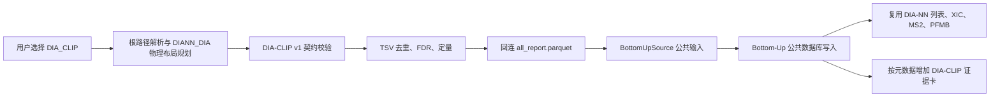

# DIA-CLIP 导入、可视化与维护说明

## 1. 本次实现结论

DIA-CLIP 已作为 Bottom-Up 的独立导入类型接入，但没有复制一套 DIA-NN 数据库写入和可视化实现。

当前边界是：

- 用户在导入前明确选择 `DIA_CLIP`；后端不替用户猜测业务类型。
- 旧版 DIA-CLIP v1 负责读取候选、逻辑前体去重、target/decoy FDR、重打分和定量。
- 新版 DIA-CLIP FDR parquet 已经包含 Run、RT、precursor m/z、蛋白、肽段、score、q-value 和 quantity，可直接作为展示上下文。
- 旧版导入仍由 DIA-NN `all_report.parquet` 提供 Run、RT、precursor m/z、蛋白和肽段等展示上下文。
- 两者在适配完成后都进入同一个 `BottomUpSource` 窄接口，再复用现有 Bottom-Up 写入、XIC、MS2、PFMB 和列表/详情 API。
- 页面仍使用 DIA-NN 已有的 Bottom-Up 视图；只有存在 `extra_metadata.diaclip` 时才增加 “DIA-CLIP evidence” 卡片。



这样划分的价值是：变化被限制在“来源适配层”，稳定的数据库模型和展示链路不需要维护两份；以后 DIA-CLIP 表头或算法变化时，不会把分支判断散落到 API、SQL 和多个页面中。

## 2. 当前支持的数据契约

用户选择 DIA-CLIP 后，后端支持两种互斥契约。

### 2.1 FDR parquet + mzML

这是当前推荐的服务器上传契约。所选目录必须同时满足以下条件：

1. 恰好存在一个 DIA-CLIP FDR parquet，当前按完整 schema 识别，样例文件名为 `*.diaclip.fdr.parquet`。
2. FDR parquet 必须恰好包含一个 `Run`。
3. 目录中必须存在可与 `Run` 匹配的未压缩 `.mzML`。若目录中只有一个 mzML，可使用单运行 fallback；多 mzML 时必须按 run 名精确匹配。
4. 一次导入只使用一个结果 parquet；同结果 TSV 只作为人工检查副本，不参与导入。

当前 FDR parquet 契约字段为：

```text
Run.Index
Run
Precursor.Id
Modified.Sequence
Stripped.Sequence
Precursor.Charge
Decoy
Proteotypic
Precursor.Mz
Protein.Ids
Protein.Group
Protein.Names
Genes
RT
iRT
Predicted.RT
Predicted.iRT
IM
iIM
Predicted.IM
Predicted.iIM
RT.Start
RT.Stop
FWHM
DIAClip.Score
DIAClip.Q.Value
DIAClip.Feature.Distance
DIAClip.Cosine.Similarity
DIAClip.Quantity
DIAClip.Passed
```

导入过滤为：`Decoy == 0`、`DIAClip.Passed == true`、`DIAClip.Q.Value < 0.01`。

### 2.2 旧版 TSV + all_report.parquet

旧版所选目录必须同时满足以下条件：

1. 目录整体满足现有 DIA-NN Bottom-Up 物理布局：报告加 `.raw`、未压缩 `.mzML` 或 Bruker `.d` 谱图源。
2. 恰好存在一个名为 `all_report.parquet` 的 DIA-NN 完整报告。`target_report.parquet` 不能替代它，因为 FDR 后通过的 DIA-CLIP target 必须能回连完整候选上下文。
3. `all_report.parquet` 中恰好只有一个 `Run`。
4. 恰好存在一个 TSV，其表头至少包含：

   ```text
   label
   score
   feature_distance
   cos_similarity
   modified_peptide
   charge
   quant_result
   ```

5. TSV 文件名不固定；识别依据是版本化表头契约，不是 `mix-10-50-40-model-all-result-1.tsv` 这个样例名。

v1 限制为单运行，是因为当前 TSV 没有 `Run` 或等价的稳定 run 标识。若直接把多运行结果仅按肽段和电荷回连，会把同一前体错误分配到不同 run，因此这里选择明确拒绝，而不是静默猜测。

浏览器预检只用于尽早提示用户；服务器会在创建任务前和任务执行时再次执行权威校验，不能依赖前端保证数据正确。

## 3. 候选、FDR 与字段映射

### 3.1 逻辑前体键

v1 使用以下键去重和回连：

```text
(规范化 modified_peptide, charge, decoy)
```

当前唯一的序列规范化规则是：

```text
C(Carbamidomethyl) -> C(UniMod:4)
```

`label=1` 为 target，`label=0` 为 decoy；内部键的 `decoy` 值为 `1-label`。

同一逻辑前体出现多行时：

- 保留最高 `score` 的行；
- `quant_result` 必须一致；
- 如果定量冲突，整次导入失败并指出冲突行，不任意挑选一个值。

先去重再计算 FDR，可以避免重复候选人为改变 target/decoy 累积计数。定量冲突采取 fail-closed，是为了防止一个看似成功的导入掩盖无法解释的定量口径。

### 3.2 FDR

实现标识为 `target_decoy_tie_aware_v1`：

1. 按 `score` 降序；
2. 相同分数作为一个整体累加，避免文件原始行顺序改变结果；
3. 每个分数阈值计算：

   ```text
   cumulative_decoy / (cumulative_target + cumulative_decoy)
   ```

4. 从低分到高分做反向累计最小值得到 q-value；
5. 仅导入 target 且 `q-value < 0.01` 的候选。

算法、阈值、比较符和并列处理方式都会写入 dataset 的 `extra_metadata.diaclip_fdr`，便于以后复现和审计。

### 3.3 数据落点

| 来源 | Viewer 落点 | 说明 |
| --- | --- | --- |
| DIA-CLIP `score` 或 `DIAClip.Score` | `identification_matches.score` | 重打分结果 |
| 计算所得 q-value 或 `DIAClip.Q.Value` | `identification_matches.q_value` | Viewer 的筛选 q-value |
| `quant_result` 或 `DIAClip.Quantity` | `identification_matches.intensity` | DIA-CLIP 定量主值 |
| `feature_distance`/`DIAClip.Feature.Distance`、`cos_similarity`/`DIAClip.Cosine.Similarity` | `identification_matches.extra_metadata.diaclip` | 来源专属证据 |
| 原始 DIA-NN Q/Global Q/quantity | `identification_matches.extra_metadata.diaclip` | 内部上下文与审计；前端仅以 Reference 字段展示，不覆盖 DIA-CLIP 主值 |
| DIA-NN 或 FDR parquet 的 Run、RT、m/z、序列、蛋白 | 现有公共字段 | 统一复用 Bottom-Up 展示链路 |
| 搜索引擎/来源软件 | `DIA-CLIP` | 页面 badge 和详情可识别来源 |

旧版 v1 TSV 与新版 FDR parquet 都只提供表格标量，没有导出 DIA-CLIP 模型内部使用的 XIC 向量、张量或逐点表征。因此 Viewer 当前能可靠展示的是：

- 从原始谱图读取的现有 precursor/product XIC；
- DIA-CLIP 的重打分、FDR、定量和两个表征相关标量。

Viewer 不会根据这些标量臆造模型内部 XIC 表征。若未来 DIA-CLIP 导出逐点向量或 sidecar，应先定义其坐标、归一化、缺失值和 Run 关联协议，再增加独立的可选可视化组件。

## 4. 本次代码改动

### 4.1 新增后端模块

- `back/app/import_types.py`
  - HTTP、上传会话和任务层共用的显式导入类型枚举。
- `back/app/services/import_selection.py`
  - 只负责“用户选择类型”和“已规划物理布局”的契约校验。
- `back/app/ingest/bu/bottom_up_identification.py`
  - `BottomUpIdentification` 与 `BottomUpSource` 公共窄接口。
- `back/app/ingest/bu/diaclip_result_reader.py`
  - DIA-CLIP v1 表头发现、严格解析、去重、FDR、单运行限制及 DIA-NN 回连。
- `back/app/ingest/bu/diaclip_fdr_result_reader.py`
  - DIA-CLIP FDR parquet schema 校验、单运行限制、target/passed/q-value 过滤和直接 Bottom-Up 映射。
- `back/app/ingest/bu/diaclip_source.py`
  - 统一检测旧版 TSV+context 与新版 FDR parquet 两种 DIA-CLIP 契约。
- `back/app/ingest/bu/universal_diaclip_adapter.py`
  - 薄适配器，把准备好的 DIA-CLIP 数据交给公共 Bottom-Up 写入器；优先使用 FDR parquet，缺失时回退旧版 TSV+context。

### 4.2 修改后端模块

- `back/app/ingest/bu/universal_diann_adapter.py`
  - 原 DIA-NN 行为保留在包装入口；
  - 数据库写入主体抽成 `ingest_universal_bottom_up`；
  - score、q-value、intensity、search engine 和来源元数据由公共输入提供。
- `back/app/import_uploads/dispatch.py`、`back/app/api/v1/imports.py`
  - 上传和服务器路径导入都可携带显式 `import_type` 并在入队前校验。
- `back/app/services/import_jobs.py`
  - 任务记录保存 `import_type`；
  - 只有显式 `DIA_CLIP` 才路由到 DIA-CLIP 适配器；
  - 重复识别从单一指纹改为 `(source_dataset_fingerprint, source_import_kind)`。
- `docs/universal_schema.sql`
  - 同步新增列和复合唯一索引。

### 4.3 前端

- 导入类型新增 `DIA-CLIP`。
- 选择前提示 v1 所需文件和单运行限制。
- 文件夹选择后检查唯一 `all_report.parquet`、谱图源和唯一匹配表头的 TSV。
- DIA-CLIP 上传提示把 `all_report.parquet` 称为 context report，不向用户暴露其内部 DIA-NN 来源。
- overview、QC、run 信息和无描述时的默认文案按 `source_software=DIA-CLIP` 显示 DIA-CLIP 品牌。
- DIA-CLIP 的已有自定义描述若包含 `DIA-NN`，展示层改写为 `reference`；数据库原值不变。
- DIA-CLIP match 列表显示 DIA-CLIP score、q-value 和 quantity；普通 DIA-NN 列表继续使用原有列。
- match 详情在有 DIA-CLIP 元数据时显示 score、feature distance、cosine similarity、DIA-CLIP quantity 及 Reference 上下文值。
- `diann_run_name`、`diann_q_value`、`diann_precursor_quantity` 等内部字段保持不变，只在展示层重新命名。
- 普通 DIA-NN 数据不会出现 DIA-CLIP 卡片。

### 4.4 测试

新增或扩展的测试覆盖：

- 任意 TSV 文件名与表头识别；
- 多个匹配 TSV 的拒绝；
- 修饰规范化、重复折叠和冲突定量拒绝；
- 与输入顺序无关的并列分数 FDR；
- 单运行成功、多运行拒绝；
- DIA-CLIP 到 DIA-NN report 的无歧义回连；
- 用户选择类型校验、上传任务透传和 worker 路由；
- 公共写入契约保留 DIA-CLIP score/q/intensity/metadata；
- 前端预检、任务恢复类型和可选证据卡；
- DIA-CLIP 与 DIA-NN 的 overview、run、match 列和详情标签分流，防止品牌串用。

### 4.5 适配器名称遮蔽回归修复（2026-07-24）

`universal_diaclip_adapter.py` 的公开参数 `replace: bool` 必须继续与公共
Bottom-Up writer 的接口保持一致，但不能与 `dataclasses.replace` 使用同一个
本地名称。否则任何通过前置校验并进入 DIA-CLIP 适配器的导入都会把布尔值当作
函数调用，并稳定失败为：

```text
TypeError: 'bool' object is not callable
```

当前实现将 dataclass 工具函数别名为 `dataclass_replace`，保留 `replace`
参数不变，避免破坏调用方契约。回归测试位于
`back/tests/test_bu_diaclip_adapter.py`，同时覆盖 `replace=True` 和
`replace=False`、DIA-CLIP 元数据合并以及公共 writer 参数转发。

维护适配器入口时，应避免让配置参数遮蔽同模块调用的函数、模块或类型；涉及公共
writer 的参数名优先保持兼容，通过导入别名解决局部冲突，而不是同时修改所有调用方。

## 5. 重复识别为何改成复合键

数据集指纹仍是目录元数据 manifest 的 MD5：

```text
相对路径 | size | mtime
```

它不是文件内容哈希。现在唯一业务键是：

```text
(source_dataset_fingerprint, source_import_kind)
```

因此：

- 同一物理目录可以分别作为 `DIA_NN` 和 `DIA_CLIP` 导入；
- 同一物理目录按同一种类型重复导入会被拒绝；
- 其他类型也不会因为恰好共享物理文件而互相占用解释空间。

这与“用户选择业务解释，后端只验证契约”的产品语义一致。复制文件时若 mtime 改变，元数据指纹也会改变；服务器同步数据时建议保留时间戳，以维持稳定的重复识别结果。

## 6. 后续维护规则

### 6.1 DIA-CLIP 表头变化

不要直接放宽 v1 必填列或在公共 writer 中加入兼容分支。推荐流程：

1. 保存一份去隐私的小型真实样例；
2. 明确新版本的必填列、label 含义、score 方向、修饰格式、Run 标识和 quant 口径；
3. 在 DIA-CLIP reader 内新增版本化契约和映射；
4. 若 FDR 语义改变，使用新的 `fdr_method`，不要复用 `target_decoy_tie_aware_v1` 名称；
5. 把原始来源字段写入版本化 metadata；
6. 为旧版和新版分别保留回归测试；
7. 前端提示和预检与后端契约同步，但后端始终是权威校验。

只有在真实 v2 出现后再引入 schema registry；当前只有一个版本，提前建立复杂插件框架会增加维护面而没有收益。

### 6.2 支持 DIA-CLIP 多运行

必须先让 DIA-CLIP 输出提供可稳定映射的 `Run` 或等价 run id，然后：

1. 把 Run 加入逻辑前体键；
2. 验证它与 `all_report.parquet.Run` 的一一映射；
3. 增加“同前体跨 run”及“run 缺失/歧义”测试；
4. 移除 v1 的单运行拒绝；
5. 更新 schema version 和文档。

不能只删除单运行检查，否则会产生可展示但归属错误的鉴定。

### 6.3 添加新的导入类型

先判断它属于哪一类：

- **同一物理布局、不同业务解释**：类似 DIA-CLIP。新增显式 enum、选择契约、来源 reader/adapter，并尽量产出 `BottomUpSource`；不要新增 planner shape。
- **新的物理布局**：才扩展根路径 resolver、planner/detector 和新的 shape。

最小接入清单：

1. 在后端共享 `ImportType` 和前端 `ImportUploadType` 增加类型；
2. 在 `validate_import_selection` 定义所选类型的契约；
3. 新建独立 reader，完成来源字段解析和 provenance；
4. 若可映射到现有规范模型，产出 `BottomUpSource` 并复用 writer；
5. 在 worker 做唯一的一次 adapter 路由；
6. 给上传页增加输入说明和轻量预检；
7. 只有来源确有专属指标时才增加可选 UI 卡片；
8. 覆盖成功、缺列、歧义、重复、边界值、路由、数据库字段和旧类型回归；
9. 更新本文档、schema 和 `cs/` 验收入口。

只有当现有规范数据模型无法无损表达新类型时，才修改公共 writer 或数据库表；这能避免每新增一种工具就复制整个导入和可视化栈。

### 6.4 前端来源展示与内部字段

前端的业务来源判断只使用 API 返回的 `source_software`，当前 DIA-CLIP 的显式值为
`DIA-CLIP`。不要根据 slug、文件名、TSV 表头或 `diann_*` 字段猜测来源，因为这些
内容属于物理布局和内部实现，不是稳定的产品契约。

DIA-CLIP 页面遵守以下规则：

1. 用户可见的 QC、run、score、q-value、quantity 和默认说明使用 DIA-CLIP 名称；
2. 来自底层上下文、但仍有审计价值的值使用 `Reference` 标签；
3. 已存描述中的 `DIA-NN` 在展示时改写为 `reference`，存储值不修改；
4. 数据库和 API 内部的 `diann_*` 字段可以继续保留，避免无收益的迁移和兼容破坏；
5. 普通 DIA-NN 数据继续显示 DIA-NN，不因 DIA-CLIP 品牌处理而改变；
6. 新增来源类型时，必须同时增加“新来源显示正确”和“既有来源没有回归”两组测试。

当前实际路由使用 `front/src/features/bu/`。`front/src/features/bu-viewer/` 是未被
`App.tsx` 引用的重复目录；除非另有清理任务，不要在两个目录同步复制改动。

## 7. 同步到服务器时的适配

仓库目前没有已验证的 Docker、systemd 或 Nginx 生产方案，以下是部署前检查项，不把未实现的基础设施写成已有能力。

### 7.1 推荐传输和导入方式

样例中 Thermo RAW 约 9.15 GB。当前浏览器上传按文件顺序传输，刷新或 API 进程中断后不能断点续传。生产服务器优先采用：

1. 用支持断点续传并保留时间戳的 SFTP/rsync 工具把完整目录传到服务器 `DATA_ROOT` 下；
2. 校验 TSV、parquet 和谱图文件大小；
3. 调用服务器路径导入 API，并显式传 `DIA_CLIP`。

示例请求体：

```json
{
  "source_path": "/srv/viewer-data/dia-clip/sample-one",
  "slug": "sample-one-diaclip",
  "name": "Sample One DIA-CLIP",
  "description": "DIA-CLIP v1 with DIA-NN context",
  "import_type": "DIA_CLIP"
}
```

接口为 `POST /api/v1/imports`。不要在远程服务器启用本机文件夹选择器让用户选择服务器桌面路径。

若必须经过浏览器上传，需要同时确认：

- 反向代理允许大于最大单文件的 request body；
- 代理、负载均衡和 API 的读写超时覆盖 9 GB 文件传输；
- `IMPORT_UPLOAD_MAX_FILE_BYTES`、`IMPORT_UPLOAD_MAX_TOTAL_BYTES` 未设得过小；
- `IMPORT_UPLOAD_MAX_FILES` 覆盖目录总文件数；
- `DATA_ROOT` 磁盘空间除原文件外，还能容纳 RAW 转换 mzML、派生索引和 `IMPORT_UPLOAD_DISK_RESERVE_BYTES`。

### 7.2 环境配置

生产环境至少核对：

```text
VIEWER_ENV=production
DATABASE_URL=...
DATA_ROOT=/srv/viewer-data
IMPORT_PATH_MUST_BE_UNDER_DATA_ROOT=true
IMPORT_NATIVE_FOLDER_PICKER=false
IMPORT_PICKER_LOOPBACK_ONLY=true
API_CORS_ORIGINS=https://viewer.example
```

有 Thermo `.raw` 时还要处理：

- 当前代码直接执行 `THERMO_RAW_FILE_PARSER_EXE` 指向的工具；必须在目标操作系统实测可执行。
- 若服务器无法运行该转换器，先离线生成同 stem、未压缩且带索引的 `.mzML`，再同步目录。
- `RAW_CONVERSION_OUTPUT_DIR` 所在磁盘必须可写且容量充足。
- `RAW_CONVERSION_TIMEOUT_SECONDS` 要覆盖服务器上真实单文件转换时间。

### 7.3 数据库升级

启动代码会幂等执行：

- `import_jobs.import_type` 新列；
- `datasets.source_import_kind` 新列及旧数据回填；
- 删除旧的单列指纹唯一索引；
- 建立 `(source_dataset_fingerprint, source_import_kind)` 部分唯一索引。

上线顺序：

1. 备份 PostgreSQL；
2. 停止新的导入任务；
3. 同步后端和前端同一版本；
4. 用具备 `ALTER TABLE`、`DROP INDEX`、`CREATE INDEX` 权限的数据库角色首次启动；
5. 检查启动日志无 schema bootstrap 错误；
6. 核对列、索引及旧数据的 `source_import_kind`；
7. 先用小型样例 smoke test，再导入完整数据。

后端和前端不能只升级一边：旧前端不会提供 DIA-CLIP 选项，而新前端连接旧后端会被枚举校验拒绝。

同步本次适配器修复后必须重启后端进程。正在运行的 Python 进程不会自动重新加载
该模块；旧进程仍会在每次有效 DIA-CLIP 导入进入适配器时触发相同错误。

### 7.4 运行期注意

- 当前 ImportJob 是进程内后台线程，不是持久化队列；服务重启不能自动续跑正在执行的导入。
- 全量样例的数据准备阶段约处理 58 万候选。部署初期不要并发启动多个大型 DIA-CLIP 导入，先观察实际 RAM、CPU、磁盘吞吐和数据库写入。
- DIA-CLIP 的 XIC/MS2 能否展示最终仍取决于谱图源和 Run 映射，与 DIA-NN 现有要求相同。
- PFMB 是可选旁路；缺少 PFMB 不应阻断基本 DIA-CLIP 导入和 XIC/MS2。

## 8. 验收与故障定位

能力验收入口见 `cs/DIA-CLIP导入验收.py` 和 `cs/DIA-CLIP导入验收说明.md`。

常见失败的定位顺序：

1. **选错类型**：确认用户选择的是 `DIA_CLIP`。
2. **物理布局失败**：确认报告和谱图源处于同一个可解析根目录。
3. **表头失败**：检查是否恰好一个 TSV 满足 v1 必填列。
4. **多运行失败**：检查 `all_report.parquet.Run` 唯一值数量。
5. **定量冲突**：按错误中的序列、电荷和行号检查重复候选。
6. **回连失败或歧义**：检查修饰表示、charge、decoy 和 report 行唯一性。
7. **XIC/MS2 缺失**：检查 run 与 `.raw`/`.mzML`/`.d` 映射及 RAW 转换结果。
8. **重复导入**：检查 fingerprint 和 `source_import_kind` 是否都相同。
