# Viewer 内部项目说明和使用文档

> 内部私有文档。用于项目介绍、使用说明、模块交接和截图索引。请勿作为公开产品文档或对外承诺材料直接分发。

生成时间：2026年7月7日 14:15:48  
截图 manifest：`docs/internal/screenshot-manifest.json`

## 1. 文档说明

文档只说明当前仓库和当前运行环境能确认的页面、接口、数据链路和限制；未确认或未发现实现的能力会明确标注。

本次任务只新增内部文档、截图和文档生成脚本；不修改业务代码、前端源码、后端源码、数据库结构、数据库数据、配置、依赖、锁文件或测试文件。

## 2. 项目总览

Viewer 是质谱数据可视化和分析辅助系统。当前源码支持 Top-Down、Bottom-Up 和 spectra-only 三类数据浏览，其中本次运行环境自动发现的可用数据主要是 Bottom-Up DIA-NN 数据集和 mzML/RAW 转换后的 spectra-only 数据集。

项目主链路是：前端 React/Vite 页面通过 `/api/v1` 调用 FastAPI；后端从 PostgreSQL 读取 dataset/run/match 等 metadata 和路径；谱图、色谱、PFMB 和 scan-index 等大数据或派生数据仍保存在磁盘上。数据库保存 metadata、路径和关系，不保存 RAW/mzML/PFMB 文件本体。

本次截图自动发现：

- spectra-only 数据集：`raw`，run_id：`15`
- Bottom-Up 数据集：`dia-shuju`，run_id：`13`
- Bottom-Up match：`880232`，sequence：`AAAAASAAGPGGLVAGK`

## 3. 适用读者

- 老师或领导：快速了解项目能做什么、当前已有数据和页面截图。
- 团队成员：理解前端、后端、数据库和磁盘派生文件之间的边界。
- 后续接手开发人员：定位关键源码、API、数据链路和限制。
- 测试人员：根据截图清单、典型流程和已知边界设计验收用例。

## 4. 当前支持的数据和能力

| 能力 | 当前状态 | 已确认依据 | 限制或注意事项 |
| --- | --- | --- | --- |
| RAW文件 | 部分实现 | Thermo RAW 可经 ThermoRawFileParser 转为 uncompressed indexed mzML；当前未确认所有厂商 RAW。 | 依赖外部转换器、路径配置和 indexed mzML 校验。 |
| mzML文件 | 已经实现 | mzML-only 和 RAW 转换后 mzML 可导入为 spectra-only run。 | gzip mzML 不支持 indexed random access 和 scan index。 |
| spectra-only谱图浏览 | 已经实现 | `/datasets/:slug` 在 spectra-only dataset 上展示 scan list、TIC/BPC 和 MS1/MS2 谱图。 | 依赖 scan-index、chromatogram summary 和可读 mzML。 |
| chromatogram查看 | 已经实现 | spectra-only 与 BU overview 均可查看 TIC/BPC。 | 依赖 `.viewer-derived` chromatogram summary；缺失或 stale 时需 backfill。 |
| Bottom-Up结果查看 | 已经实现 | DIA-NN Bottom-Up dataset 支持 overview、protein、peptide、match detail。 | 当前主路径是 `front/src/features/bu`。 |
| Precursor XIC | 已经实现 | BU match detail 通过 MS1 scan index 提取前体离子 XIC。 | 无 scan-index 或无信号时页面可能为空。 |
| Product ion XIC | 已经实现 | BU match detail 可选择 live MS2 匹配碎片并查看 product ion XIC。 | 依赖 MS2 scan、scan-index 和 product ion m/z；部分离子可能无信号。 |
| MS1谱图 | 已经实现 | spectra-only 和 BU match detail 均可从 mzML 读取 MS1。 | RAW 本身不直接在浏览器解析。 |
| MS2谱图 | 已经实现 | spectra-only 可按 scan 读取 MS2；BU match detail 可显示 live mzML MS2 fragment matching。 | live MS2 与 PFMB 预计算证据来源不同。 |
| PFMB预计算证据 | 依赖数据或索引 | `dia-shuju` 当前发现 `has_ms2_pfmb=true`，截图中 PFMB heatmap 可用。 | PFMB sidecar 缺失时 BU 可降级为没有 Fragment Match。 |
| scan-index或派生索引文件 | 依赖数据或索引 | scan-index 与 chromatogram summary 存在于 `.viewer-derived`，格式为 `.npz + .json`。 | 派生文件可重建，不应视为数据库表。 |
| Top-Down能力 | 部分实现 | 源码存在 Top-Down proteins/proteoforms/PrSM 路由和组件。 | 本次自动发现的当前数据集中未发现 Top-Down dataset，因此未生成 Top-Down 页面截图。 |
| DIA能力扩展 | 部分实现/后续规划 | 当前 BU DIA-NN 链路可用，Bruker `.d` 部分路径存在。 | 通用 DIA 或更多厂商数据仍需按 adapter 和 reader 扩展。 |

## 5. 启动和访问方式

### 后端

当前后端是 FastAPI + SQLAlchemy + PostgreSQL，后端 README 中确认的常规启动方式如下：

```powershell
cd back
uv sync
Copy-Item .env.example .env -ErrorAction SilentlyContinue
uv run uvicorn app.main:app --reload --port 8000
```

浏览器访问 `http://localhost:8000/docs` 可查看 OpenAPI。数据库表结构以 `docs/universal_schema.sql` 为真源。首次使用前需要准备 PostgreSQL、`back/.env` 中的 `DATABASE_URL`，以及可被后端访问的数据目录。

本次截图为了严格避免数据库结构修改，未使用带 bootstrap 写入风险的默认启动方式，而是以数据库只读事务参数启动后端。启动期 `CREATE/ALTER ... IF NOT EXISTS` 被数据库只读事务拦截，服务仍可提供 GET 页面/API 读取能力。

### 前端

前端是 React + Vite + TypeScript。常规启动方式：

```powershell
cd front
pnpm run dev
```

如本机没有 pnpm，`start-front.bat` 会回退到 `npm run dev`。Vite 配置中 `/api` 代理到 `http://127.0.0.1:8000`，默认访问地址是 `http://localhost:5173` 或 `http://127.0.0.1:5173`。

### 派生数据准备

spectra-only、chromatogram、BU XIC 和 live MS1/MS2 通常依赖 `.viewer-derived` 下的 scan-index 和 chromatogram summary。导入完成后会尝试触发派生数据生成；已有数据缺失或 stale 时，需要按页面提示或后端脚本执行 backfill。

## 6. 典型操作流程

### 流程1：查看RAW或mzML中的原始谱图

在数据集列表选择 spectra-only 数据集，如 `raw`；进入 `/datasets/raw` 后选择 run；在 scan list 中选择 MS1 或 MS2 scan；右侧查看 chromatogram、acquisition context 和谱图。RAW 数据需要先转换为 mzML 或已有 converted mzML，页面实际读取的是 mzML。

### 流程2：查看整体色谱图

进入 spectra-only 页面或 BU overview；在 Run Chromatogram 中查看 TIC/BPC；必要时切换 TIC/BPC。若派生 chromatogram summary 缺失或 stale，页面会提示需要 backfill。

### 流程3：查看Bottom-Up鉴定结果

在数据集列表选择 BU 数据集，如 `dia-shuju`；进入 overview 查看总览和 run；进入 proteins/peptides/matches 列表；打开 match detail；查看 Precursor XIC、live MS1/MS2、Product ion XIC、Evidence Summary 和 PFMB heatmap。

## 7. 主要模块说明

| 模块名称 | 模块作用 | 用户可以做什么 | 对应截图 | 截图重点区域 | 前端位置 | 后端接口或服务 | 当前限制和注意事项 |
| --- | --- | --- | --- | --- | --- | --- | --- |
| 数据集列表模块 | 列出已导入 dataset 并提供 folder import 入口。 | 选择 dataset、查看模式/状态、打开导入对话框。 | home-or-dataset-list.png（已生成） | 卡片中的 dataset mode、Ready 状态、run/format/source 统计。 | `front/src/pages/DatasetsPage.tsx` | `GET /api/v1/datasets`、`POST /api/v1/imports`、`POST /api/v1/imports/pick-folder` | 删除按钮存在；本文档任务未触发删除或导入。 |
| 数据集详情模块 | 按 dataset mode 分流到 spectra-only、BU 或 TD 页面。 | 进入具体数据集并查看 run、scan 或 BU overview。 | dataset-detail.png（已生成） | spectra-only run summary、scan list、chromatogram 入口。 | `front/src/App.tsx`、`DatasetModeGate`、`SpectraOnlyPage`、`BuOverviewPage` | `GET /api/v1/datasets/{slug}` | 同一路由 `/datasets/:slug` 在不同 dataset mode 下显示不同页面。 |
| RAW或mzML导入模块 | 从服务器本机目录创建导入任务。 | 粘贴或选择目录、填写 slug/name/description、轮询导入状态。 | raw-or-mzml-import.png（已生成） | 导入对话框、folder path、slug、name 和 RAW 转换说明。 | `front/src/pages/DatasetsPage.tsx` | `POST /api/v1/imports`、`GET /api/v1/imports/{job_id}` | 本次只截图导入入口，未提交导入任务。 |
| spectra-only谱图浏览模块 | 无鉴定结果时浏览原始 mzML scan。 | 选择 run、筛选 MS1/MS2、选择 scan、查看谱图。 | spectra-only-page.png（已生成） | run summary、scan list、TIC/BPC、谱图区域。 | `front/src/features/spectra-only/pages/SpectraOnlyPage.tsx` | `GET /api/v1/datasets/{dataset_id}/runs/{run_id}/scan-index` | 需要 scan-index；缺失时页面会提示 backfill。 |
| chromatogram模块 | 展示 run 级 TIC/BPC 色谱。 | 切换 TIC/BPC，观察 RT 维度整体信号。 | chromatogram-page.png（已生成） | Run Chromatogram 图、点数和 TIC/BPC toggle。 | `ChromatogramPanel`、`BuChromatogramChart` | `GET /api/v1/datasets/{dataset_id}/runs/{run_id}/chromatogram`、BU 同名路由 | 依赖 chromatogram summary；不是实时读完整 RAW。 |
| MS1谱图模块 | 显示选中 MS1 scan 的 mz/intensity 谱图。 | 从 scan list 选择 MS1，查看峰图、RT、base peak 等信息。 | ms1-spectrum.png（已生成） | MS1 spectrum card 与二维谱图。 | `SpectrumPanel`、`BuSpectrumChart` | `GET /api/v1/datasets/{dataset_id}/runs/{run_id}/spectra/{scan_number}`、BU match MS1 API | 需要 indexed mzML random access。 |
| MS2谱图模块 | 显示选中 MS2 scan 的原始峰和标注。 | 选择 MS2 scan，查看 precursor、parent MS1 和 MS2 peaks。 | ms2-spectrum.png（已生成） | Selected MS2 Spectrum 和 peak annotation。 | `SpectrumPanel` | `GET /api/v1/datasets/{dataset_id}/runs/{run_id}/spectra/{scan_number}` | spectra-only MS2 是 scan 视角，不等同于 BU match evidence。 |
| Precursor XIC模块 | 在 BU match detail 中展示前体离子 XIC。 | 查看鉴定 RT、XIC 信号和当前 inspected RT。 | precursor-xic.png（已生成） | Precursor XIC 卡片、RT 窗口和 MS1 信号。 | `BuMatchDetailPage`、`BuXicChart` | `GET /api/v1/datasets/{slug}/matches/{match_id}/xic` | 无信号时页面显示 no signal。 |
| Product ion XIC模块 | 比较选定碎片离子的 product ion XIC。 | 点击 live MS2 matched fragment 或 Add top 3 fragments 后查看 traces。 | product-ion-xic.png（已生成） | Product ion XIC comparison 控件与 traces/empty 状态。 | `BuProductIonXicCard`、`BuProductIonXicChart` | `GET /product-xic`、`POST /product-xics` | 批量接口用于计算，不应理解为写入数据库。 |
| BU Overview模块 | 展示 BU 数据集总览、QC、run chromatogram 和 RT-m/z。 | 确认 match/protein/peptide 数量，查看 run 级质量信息。 | bu-overview.png（已生成） | Summary cards、QC stats、Run Chromatogram。 | `front/src/features/bu/pages/BuOverviewPage.tsx` | `GET /api/v1/datasets/{slug}/overview`、`/overview/rt-mz`、`/runs/{run_id}/chromatogram` | RT-mz heatmap 当前是 overview 小图，不是独立大型页面。 |
| BU蛋白或肽段列表模块 | 分页浏览 BU proteins、peptides 或 matches。 | 搜索、分页、进入 protein/peptide/match detail。 | bu-protein-or-peptide-list.png（已生成） | protein 列表、peptide/match 数量和 q-value。 | `BuProteinsPage`、`BuPeptidesPage`、`BuMatchesPage` | `GET /api/v1/datasets/{slug}/proteins|peptides|matches` | 列表内容取决于导入的 DIA-NN parquet 字段。 |
| BU Match Detail模块 | 汇总单个 BU match 的序列、前体、RT、蛋白和证据入口。 | 查看 match 元数据、Evidence Summary、XIC、MS1/MS2、PFMB。 | bu-match-detail.png（已生成） | match metadata 与页面上方证据概览。 | `BuMatchDetailPage` | `GET /api/v1/datasets/{slug}/matches/{match_id}` | match 的 `scan_number=-1` 仍可通过 RT/scan-index 找最近谱图。 |
| Evidence Summary模块 | 把 identification、XIC、live MS2、PFMB 等证据分块汇总。 | 快速判断当前证据是否可用、是否有匹配或缺失。 | evidence-summary.png（已生成） | Evidence Summary 中各来源指标。 | `BuEvidenceSummary`、`evidenceSummaryModel.ts` | 由 match detail、XIC、MS2、PFMB API 组合得到 | 这些指标不是统一鉴定分数。 |
| MS2 Fragment Evidence模块 | 显示 live mzML MS2 峰和实时 b/y fragment matching。 | 查看 matched ions，并选择碎片进入 product ion XIC。 | ms2-fragment-evidence.png（已生成） | Live mzML MS2 Evidence、MS2 spectrum、fragment table。 | `BuSpectrumChart`、`BuFragmentTable` | `GET /api/v1/datasets/{slug}/matches/{match_id}/spectrum/ms2` | live 匹配和 PFMB 预计算匹配不能直接等同。 |
| PFMB Heatmap模块 | 展示预计算 Fragment Match 在不同 RT slot 下的强度矩阵。 | 选择 slot、查看 fragment coverage、matched rows 和 heatmap 联动。 | pfmb-heatmap.png（已生成） | Fragment Match heatmap、slot selection、PFMB fragment table。 | `BuPfmbAnnotationCard`、`BuPfmbHeatmap` | `GET /ms2-slots`、`GET /ms2-annotation/{prsm_index}`、`GET /ms2-annotation-matrix` | PFMB sidecar 缺失时不会有该模块证据。 |

## 8. 模块对应关系说明

| 模块 | 对应关系 |
| --- | --- |
| 数据集列表 | 负责进入不同 dataset，并暴露导入入口。 |
| 数据集详情 | 负责按 dataset mode 展示 run、状态和后续入口。 |
| spectra-only | 负责无鉴定结果时查看原始 mzML scan、MS1/MS2 和 chromatogram。 |
| chromatogram | 负责查看 TIC/BPC，帮助判断整体色谱质量和 RT 范围。 |
| BU Viewer | 负责 Bottom-Up 结果的 overview、列表和 match detail。 |
| Precursor XIC | 负责前体离子色谱证据，通常来自 MS1 scan。 |
| Product ion XIC | 负责碎片离子色谱证据，来自 selected matched fragment m/z。 |
| MS1/MS2谱图 | 负责从 indexed mzML live 读取谱峰并展示。 |
| PFMB Evidence | 负责预计算碎片匹配证据展示。 |
| Heatmap | 负责不同 RT slot 下证据强度和选择联动。 |

## 9. 重要概念解释

| 概念 | 内部解释 |
| --- | --- |
| RAW | 质谱厂商原始文件。浏览器通常不能直接完整解析，Viewer 当前确认 Thermo RAW 通过外部转换器转成 mzML 后进入可视化链路。 |
| mzML | 开放的质谱数据格式，Viewer 用它读取 scan、MS1/MS2 谱图、TIC/BPC 和 XIC。 |
| indexed mzML | 带索引且未压缩的 mzML，可按 scan 随机读取；这是当前谱图浏览和 scan-index 的关键前提。 |
| spectra-only | 没有鉴定结果或不展示鉴定实体时，直接围绕 run、scan、MS1/MS2 和 chromatogram 浏览原始谱图。 |
| MS1 | 一级质谱扫描，通常用于母离子/前体离子信号和 XIC。 |
| MS2 | 二级质谱扫描，通常用于碎片离子和序列证据。 |
| TIC | Total Ion Chromatogram，总离子流色谱，展示每个 RT 点的总强度。 |
| BPC | Base Peak Chromatogram，基峰色谱，展示每个 RT 点最高峰强度。 |
| XIC | Extracted Ion Chromatogram，在指定 m/z 窗口内提取离子强度随 RT 的变化。 |
| Precursor XIC | 围绕前体 m/z 的 XIC，常用于检查鉴定对应的色谱峰。 |
| Product ion XIC | 围绕碎片离子 m/z 的 XIC，用于观察碎片证据在 RT 维度上的一致性。 |
| Bottom-Up | 蛋白被酶切成肽段后进行鉴定和定量的流程；本项目当前 BU 主链路来自 DIA-NN。 |
| match detail | 单个鉴定匹配的详情页，聚合 peptide、protein、RT、XIC、MS1/MS2 和 PFMB 证据。 |
| PFMB证据 | 预计算 Fragment Match Binary sidecar 中的碎片匹配证据，不是 live mzML scan 本身。 |
| scan-index | 从 mzML 派生出的 scan metadata 索引，保存 scan number、MS level、RT、TIC、BPC、precursor 等，不保存完整谱峰数组。 |
| RT | Retention Time，保留时间，文档和页面中通常以分钟为单位。 |
| precursor m/z | 前体离子的质荷比，用于 MS1/XIC 和 MS2 关联。 |
| fragment ion | MS2 中的碎片离子，例如 b/y 系列，用于序列和匹配证据。 |

## 10. 当前边界和注意事项

- RAW文件通常不能直接在浏览器中完整解析，需要转换为 mzML 或内部索引后用于可视化。
- mzML谱图查看和 BU 鉴定结果查看是两条不同链路：前者按 run/scan，后者按 protein/peptide/match。
- live mzML MS2 和 PFMB 预计算证据来源不同，不能简单当成同一份谱图直接比较。
- 缺少 scan-index 或派生文件时，部分功能可能无法展示，需要先生成对应索引。
- Top-Down 和 Bottom-Up 流程不能只靠 RAW 文件自动判断，需要结合导入文件、用户选择和鉴定流程。
- 不同数据集可能缺少不同类型的证据，因此页面展示内容可能不同。
- 本次截图服务以数据库只读事务参数启动，启动期 schema bootstrap 被只读事务拦截，避免改数据库结构。

## 11. 常见问题

### 为什么有些截图没有生成？

本次 16 张建议截图全部生成成功。后续如果某数据集、路由、元素或服务不可用，manifest 会记录未生成原因。

### 为什么有些页面没有数据？

页面内容依赖当前数据库记录、磁盘源文件、scan-index、chromatogram summary 和 PFMB sidecar；缺少任一条件都可能显示 empty 或 error。

### 为什么MS1或MS2打不开？

常见原因是 mzML 不可读、不是 indexed/uncompressed、scan-index 缺失或 run metadata 指向的文件不存在。

### 为什么XIC为空？

指定 m/z/RT 范围内可能没有信号，也可能缺少 scan-index 或 mzML 访问失败。

### 为什么BU页面和spectra-only页面看到的内容不同？

BU 页面围绕鉴定结果和 match evidence；spectra-only 页面围绕 run/scan 原始谱图。两者使用不同入口和数据组织。

### 为什么PFMB和live MS2不能直接等同？

PFMB 是预计算 sidecar 的 fragment match 证据；live MS2 是从 mzML scan 读取原始峰并即时匹配，来源和字段语义不同。

### 新数据集导入后为什么需要生成索引或派生文件？

scan-index 和 chromatogram summary 能让页面快速定位 scan、XIC 和 TIC/BPC，避免每次在前端或接口里全量扫描大 mzML。

## 12. 截图清单

| 截图文件名 | 对应模块 | 是否生成成功 | 失败原因 | 页面或路由 | 生成时间 |
| --- | --- | --- | --- | --- | --- |
| home-or-dataset-list.png | 数据集列表模块 | 成功 | - | /datasets | 2026-07-07T06:03:09.144Z |
| raw-or-mzml-import.png | RAW或mzML导入模块 | 成功 | - | /datasets | 2026-07-07T06:03:10.912Z |
| dataset-detail.png | 数据集详情模块 | 成功 | - | /datasets/raw | 2026-07-07T06:03:14.131Z |
| spectra-only-page.png | spectra-only谱图浏览模块 | 成功 | - | /datasets/raw | 2026-07-07T06:03:16.805Z |
| chromatogram-page.png | chromatogram模块 | 成功 | - | /datasets/raw | 2026-07-07T06:03:20.246Z |
| ms1-spectrum.png | MS1谱图模块 | 成功 | - | /datasets/raw | 2026-07-07T06:03:23.160Z |
| ms2-spectrum.png | MS2谱图模块 | 成功 | - | /datasets/raw | 2026-07-07T06:03:27.263Z |
| bu-overview.png | BU Overview模块 | 成功 | - | /datasets/dia-shuju | 2026-07-07T06:03:29.905Z |
| bu-protein-or-peptide-list.png | BU蛋白或肽段列表模块 | 成功 | - | /datasets/dia-shuju/proteins | 2026-07-07T06:03:32.359Z |
| bu-match-detail.png | BU Match Detail模块 | 成功 | - | /datasets/dia-shuju/matches/880232 | 2026-07-07T06:03:43.931Z |
| evidence-summary.png | Evidence Summary模块 | 成功 | - | /datasets/dia-shuju/matches/880232 | 2026-07-07T06:03:57.407Z |
| precursor-xic.png | Precursor XIC模块 | 成功 | - | /datasets/dia-shuju/matches/880232 | 2026-07-07T06:04:10.834Z |
| ms2-fragment-evidence.png | MS2 Fragment Evidence模块 | 成功 | - | /datasets/dia-shuju/matches/880232 | 2026-07-07T06:04:23.638Z |
| product-ion-xic.png | Product ion XIC模块 | 成功 | - | /datasets/dia-shuju/matches/880232 | 2026-07-07T06:04:37.167Z |
| fragment-table.png | Fragment table模块 | 成功 | - | /datasets/dia-shuju/matches/880232 | 2026-07-07T06:04:48.652Z |
| pfmb-heatmap.png | PFMB Heatmap模块 | 成功 | - | /datasets/dia-shuju/matches/880232 | 2026-07-07T06:05:01.654Z |

### 截图索引

#### home-or-dataset-list.png：数据集列表模块

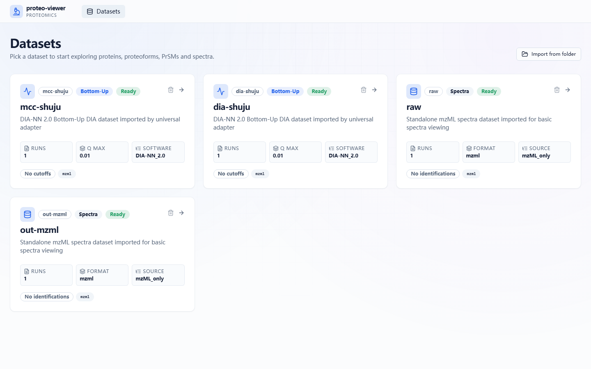

#### raw-or-mzml-import.png：RAW或mzML导入模块

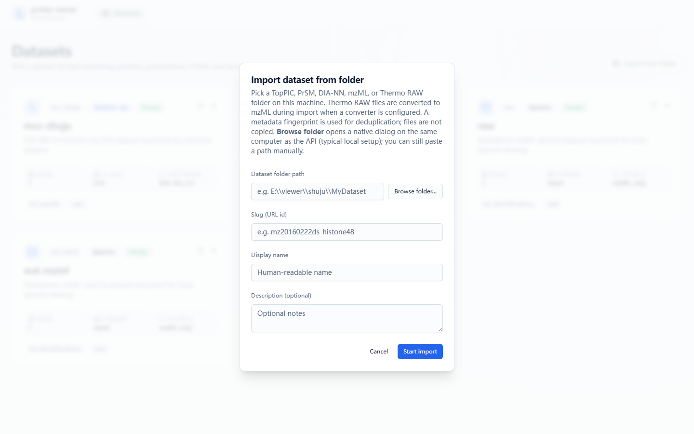

#### dataset-detail.png：数据集详情模块


#### spectra-only-page.png：spectra-only谱图浏览模块


#### chromatogram-page.png：chromatogram模块

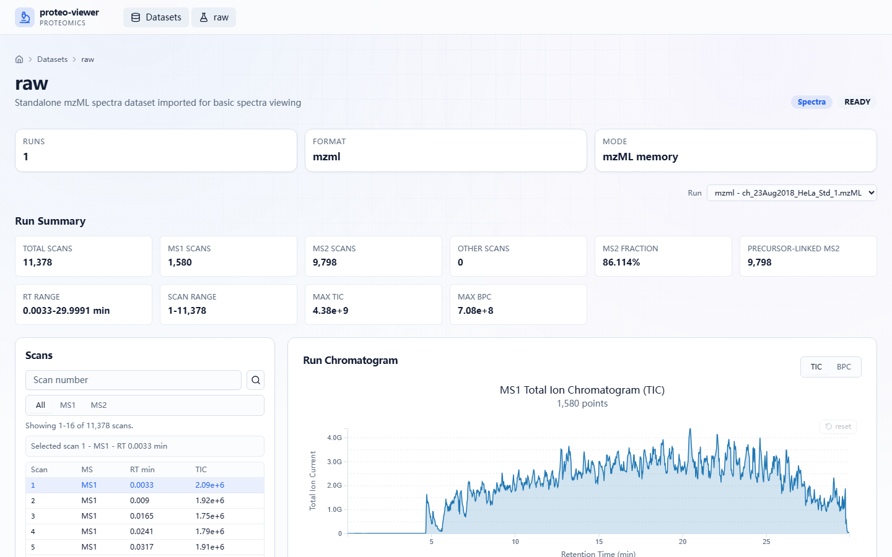

#### ms1-spectrum.png：MS1谱图模块

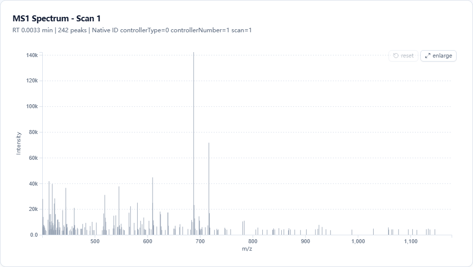

#### ms2-spectrum.png：MS2谱图模块

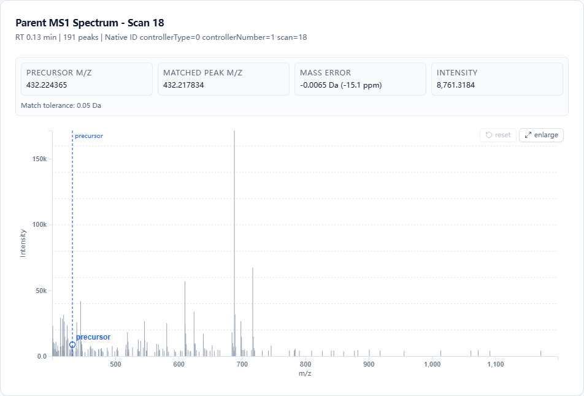

#### bu-overview.png：BU Overview模块

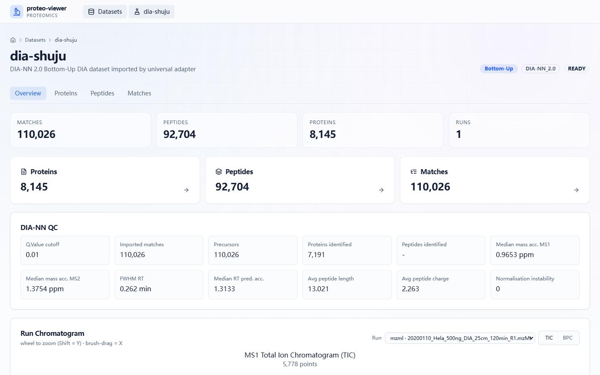

#### bu-protein-or-peptide-list.png：BU蛋白或肽段列表模块

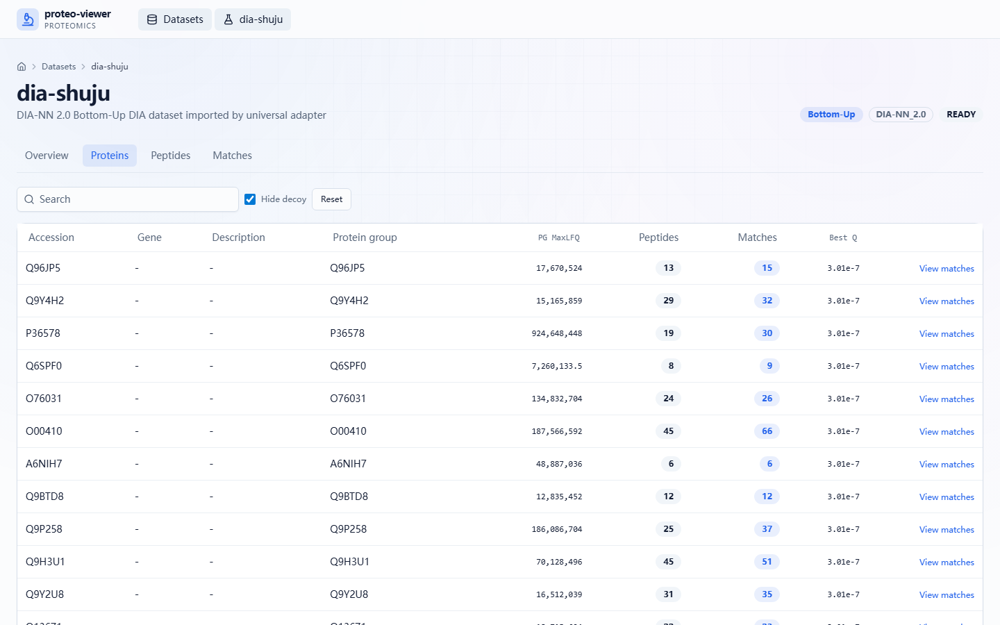

#### bu-match-detail.png：BU Match Detail模块


#### evidence-summary.png：Evidence Summary模块

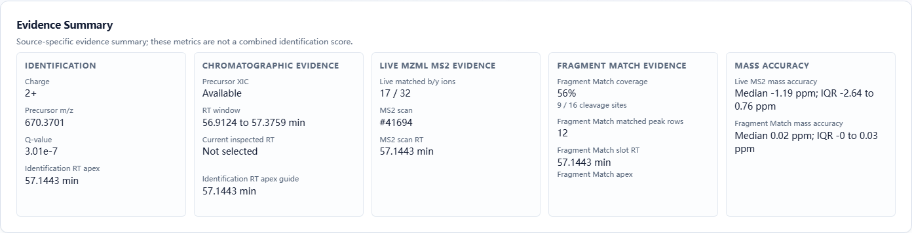

#### precursor-xic.png：Precursor XIC模块

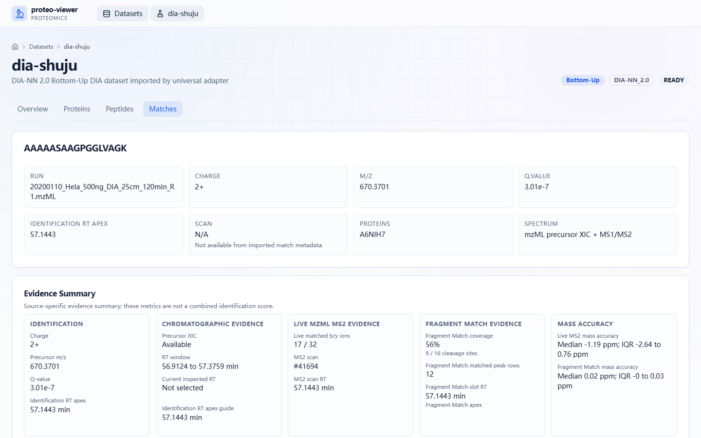

#### ms2-fragment-evidence.png：MS2 Fragment Evidence模块

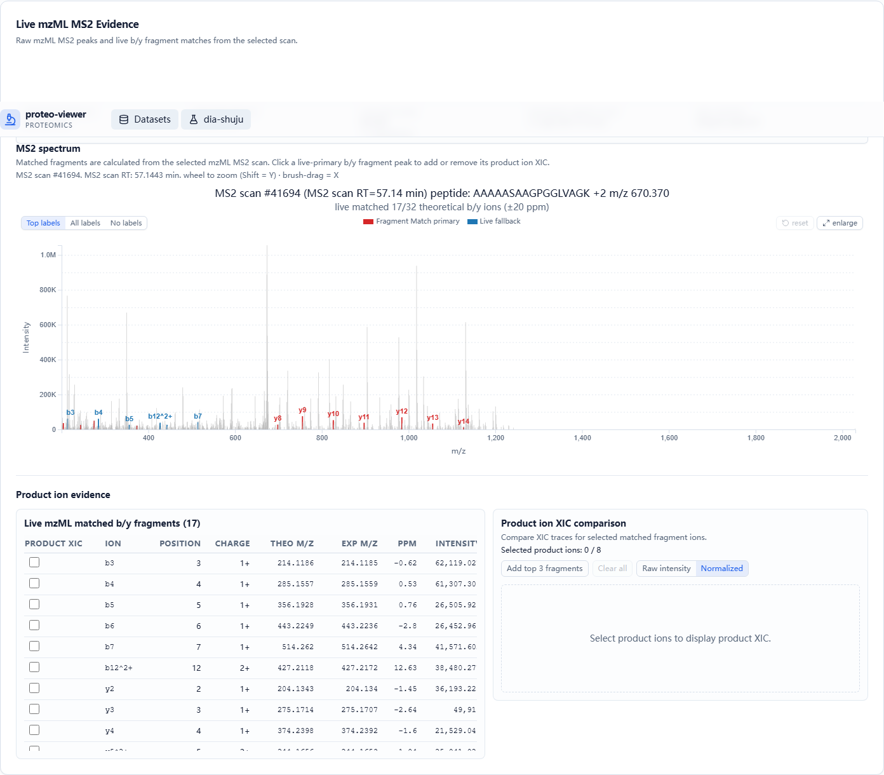

#### product-ion-xic.png：Product ion XIC模块

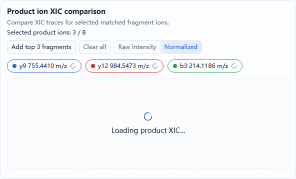

#### fragment-table.png：Fragment table模块

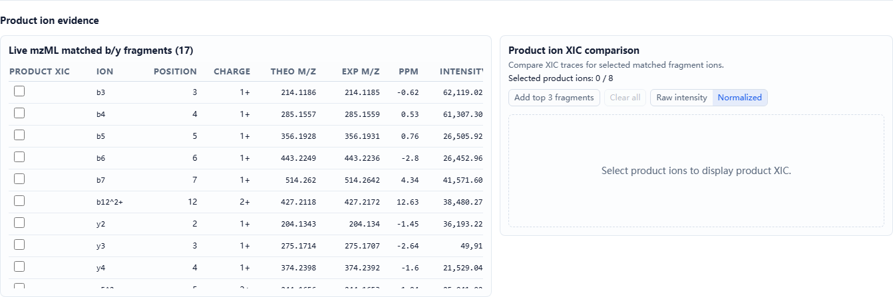

#### pfmb-heatmap.png：PFMB Heatmap模块

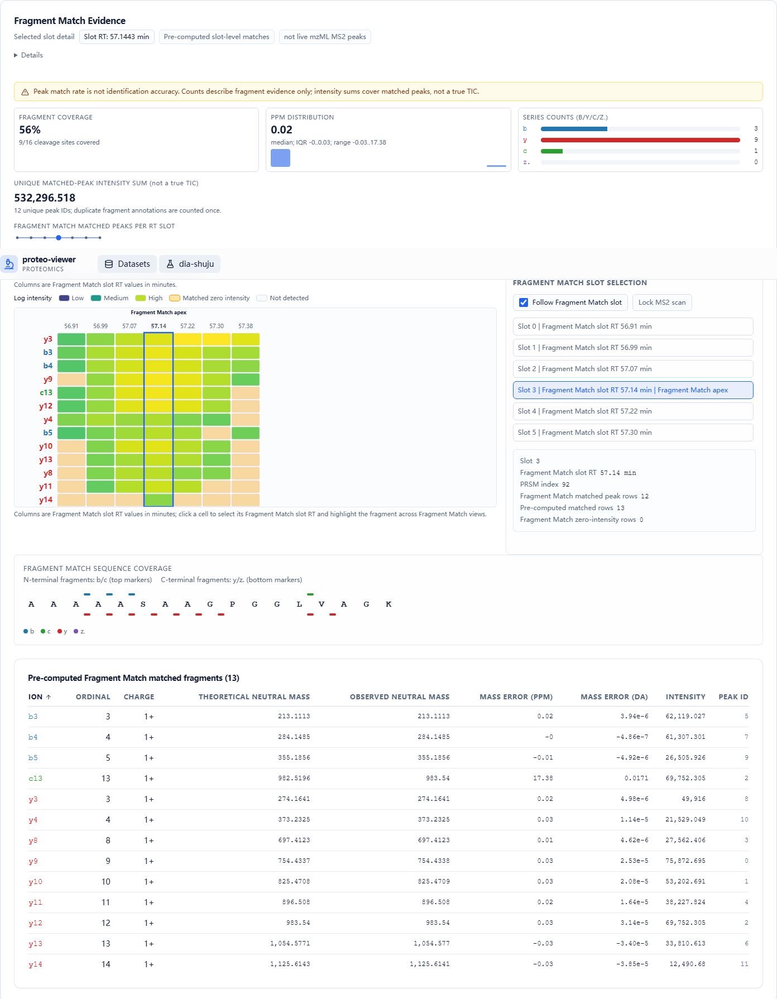

## 13. 本次调查依据

- 启动方式：`back/README.zh-CN.md`、`back/README.md`、`front/package.json`、`front/vite.config.ts`、`start-back.bat`、`start-front.bat`。
- 前端路由：`front/src/App.tsx`。
- 前端页面和组件：`front/src/pages/DatasetsPage.tsx`、`front/src/features/spectra-only/**`、`front/src/features/bu/**`。
- 后端 API：`back/app/api/v1/**`。
- 数据模型和存储边界：`docs/universal_schema.sql`、`docs/developer/*.md`。
- 本次截图数据来源：运行中的 `http://127.0.0.1:8000/api/v1/datasets` 自动发现结果。
