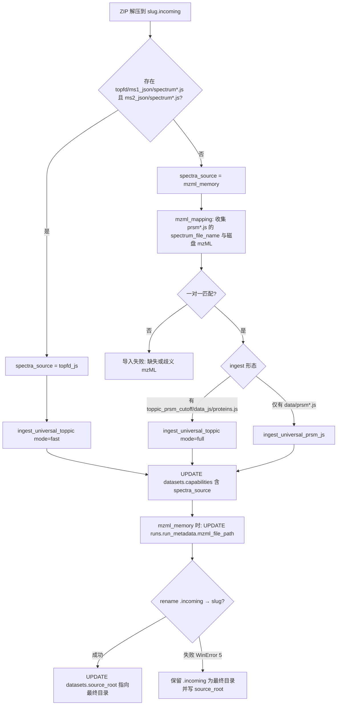
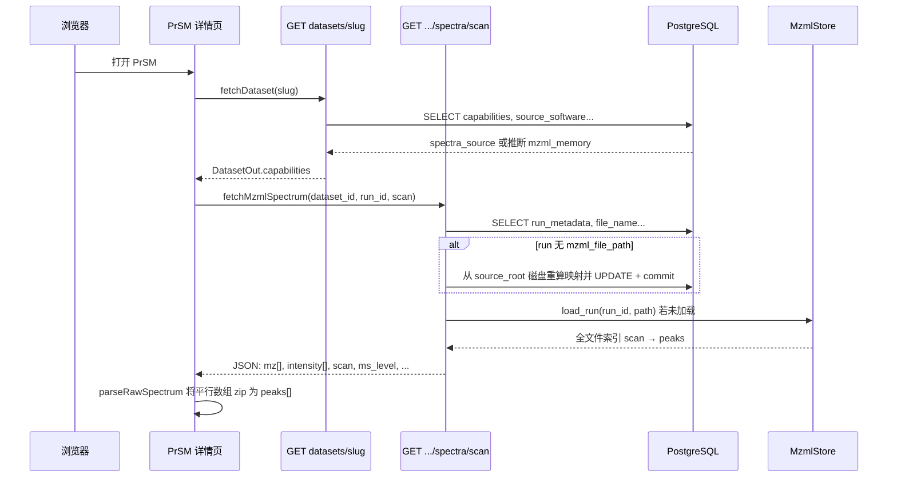
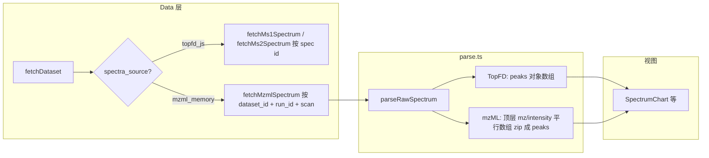

# mzML 谱图与 ZIP 导入：端到端说明（非逐行）

> 本文描述当前实现中 **「谱图数据从哪来」**、**导入时做什么**、**打开 PrSM 时发生什么**。  
> 对应源码：`import_jobs.py`、`mzml_mapping.py`、`universal_toppic_adapter.py`、`universal_prsm_js_adapter.py`、`mzml_store.py`、`mzml_spectra.py`、`datasets.py`、`universal_compat.py`、前端 `PrsmDetailPage.tsx`、`parse.ts`、`client.ts`。

---

## 1. 两种谱图源（capabilities）

| 值 | 含义 | 原始峰来源 | 典型请求 |
|----|------|------------|----------|
| `topfd_js`（默认） | TopFD 已导出 `spectrum*.js` | `topfd/ms1_json`、`topfd/ms2_json` | `GET /api/v1/datasets/{slug}/spectra/ms1/{spec_id}` |
| `mzml_memory` | 无 TopFD 拆分 JS 或走 mzML 主路径 | 磁盘上的 `.mzML` / `.mzML.gz`，**首次谱图请求时**读入进程内存 | `GET /api/v1/datasets/{dataset_id}/runs/{run_id}/spectra/{scan}` |

PrSM 解释层（序列、去卷积峰、matched ions）仍来自 **`prsm*.js`** / DB 中的 `detail_path`，与谱图源正交。

---

## 2. 导入阶段（ZIP 解压之后）

### 2.1 判别逻辑（简图）

要点：

- **导入时不解析 mzML 内容**（不占内存），只做路径与 `spectrum_file_name` 的严格映射。
- **`runs.run_metadata`**（JSONB，启动时 `ensure_runs_metadata_schema()` 补列）存 `mzml_file_path`。
- **Windows rename 失败**：不推翻 DB；`source_root` 仍指向实际存在的目录（可能是 `*.incoming`）。

### 2.2 `prsm*.js` 直导数据集（`universal_prsm_js_adapter`）

当 ZIP 为 `data/prsm*.js` + mzML（无 TopPIC HTML 树）时：

- `datasets.source_software = TopPIC_prsm_js`
- 写入最小 universal 行：`runs`（按 `spectrum_file_name` 分 run）、`proteins`/`proteoforms`/`identification_matches` 等。
- INSERT 时的 `capabilities` JSON 内应包含 **`spectra_source: mzml_memory`**（新导入）；旧数据可由 `datasets` API 按 `source_software` **推断补全**返回给前端。

---

## 3. 运行时：被动懒加载 mzML

要点：

- **`get_db()` 不自动 commit**：若动态接口内写了 `UPDATE`，必须 **`session.commit()`**，否则映射丢失。
- **`.mzML.gz`**：`MzmlStore` 用 `gzip.open` + `pyteomics.mzml.read`。
- **多 run**：`run_id` 决定读哪一份 mzML；`scan_number` 来自 `prsm` 的 `ms1_scans` / `scans`。

---

## 4. 前端：路由与解析（视图不改）

- **PrSM 详情**会多请求一次 `fetchDataset`，且 `staleTime: 0` + `refetchOnMount`，避免旧缓存一直走 TopFD。
- **`parseRawSpectrum`**：除 TopFD 的 `peaks: [{mz,intensity}]` 外，支持 mzML API 的 **`mz`/`intensity` 向量**，再统一成 `RawSpectrum.peaks`，**不改 D3/图表组件**。

---

## 5. 与 `mzml-demo` 的关系

- **索引与字段提取**（scan、`m/z array`、`intensity array`、precursor、RT）对齐 demo 思路。
- **主 viewer** 将 mzML 挂在 **按 run 的进程内单例**上，并通过 **REST** 暴露给前端，而不是 demo 的单进程单文件。

---

## 6. 运维与排错速查

| 现象 | 可能原因 |
|------|----------|
| Network 仍请求 `/spectra/ms1/{id}` | `capabilities` 无 `spectra_source` 且非 `TopPIC_prsm_js` 推断；或前端缓存旧 bundle |
| 动态接口 409「无 mzml_file_path」且未补全 | 后端未 reload；或 DB 会话未 commit（已修） |
| 谱图 200 但「no peaks」 | `parseRawSpectrum` 未识别响应形状（已支持 mz/intensity 向量） |
| scan 404 | mzML 内无该 scan 或 native id 与 scan 提取不一致 |

---

## 7. 相关 explain 逐行文件索引

- `explain/back/app/services/import_jobs.py.md`
- `explain/back/app/services/mzml_mapping.py.md`
- `explain/back/app/services/mzml_store.py.md`
- `explain/back/app/api/v1/mzml_spectra.py.md`
- `explain/back/app/api/v1/datasets.py.md`
- `explain/back/app/api/v1/universal_compat.py.md`
- `explain/back/app/ingest/universal_prsm_js_adapter.py.md`
- `explain/front/src/pages/PrsmDetailPage.tsx.md`
- `explain/front/src/features/prsm/parse.ts.md`
- `explain/front/src/api/client.ts.md`
